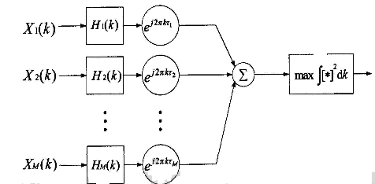
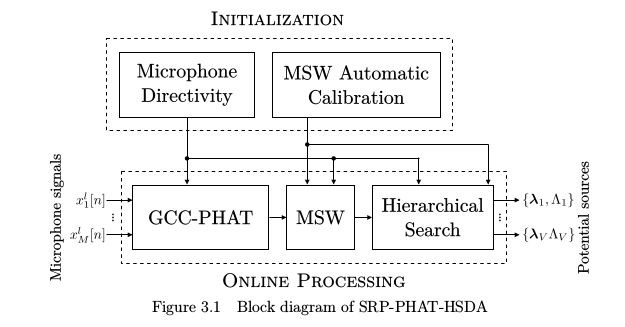
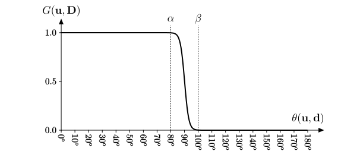
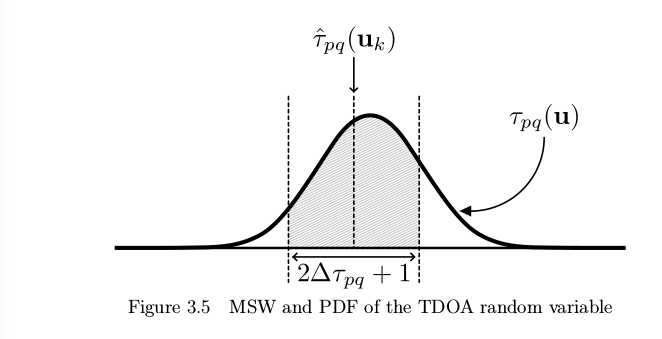
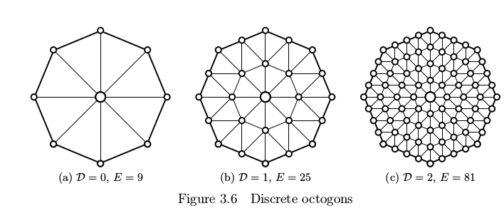
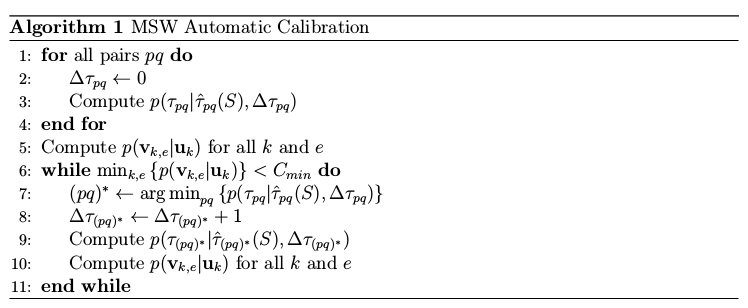

# 第二章

　　麦克风阵列技术的开始就是声源定位技术，只有通过声源定位得到声波到达时延信息或者说其中蕴涵的位置/方位信息才能将多个麦克风的数据通过波束形成技术有效地整合在一起而后进行后续的处理。因此麦克风阵列的定位准确度对麦克风阵列的效果有极大地影响。麦克风阵列声源定位技术大体可分为三类：一、基于波束形成的方法；二、基于子空间的方法；三、基于时延估计的定位方法。下面介绍各类定位技术的基本原理。然后对odas进行解析。

## 1.基于可控波束形成的声源定位技术

　　波束形成是阵列处理中一类重要技术,它通过加强特定方向传播信号的能量来修正阵列波束方向。单组阵列波束形成器通过搜索整个空间来确定能量最大的波束,从而估计出声源波达方向,而两组阵列的传播方向相交,就可以估计出声源位置。基于可控波束形成的定位算法,主要有延迟求和波束形成和自适应滤波求和波束形成方法。\(而实际上由于波传播过程中误差的存在，可能存在阵列搜索出的方向不存在交点的情况，此时若想得到声源的位置而不只是方位信息，最好的方法是多个阵列进行定位，锁定声源可能的区域。\)

### 1.1.延时求和波束形成声源定位

　　我们设麦克风数目为 $$M$$ ,第 $$m$$ 个麦克风接收信号为 $$x_m(n)$$ ，信号到达麦克风的时延为 $$\tau_m$$ ，各路麦克风接受信号的增益相同，干扰噪声在统计上相互独立，那么我们可以对语音信号 $$s(n)$$ 进行如下的合理估计：

$$
s(n)=\frac{1}{M}\sum_{m=1}^Mx_m(n+\tau_m)
$$

　　这即是最简单的延时求和波束形成器,又称固定波束形成器。它仅仅根据时间延迟对阵列信号进行时间校正,以补偿语音信号由声源到达不同麦克风所产生的延时,延时一求和波束形成器如图所示。


　　自然而然，我们想到在时域上的运算过于繁琐，可以将该延时求和波束形成器转换成频域形式进行处理计算。设声源到阵列的辐射角为 $$\theta$$ ，则方向矢量 $$\vec A(k,\theta)=[1,e^{j2\pi k\tau_1(\theta)},e^{j2\pi k\tau_2(\theta)},...,e^{j2\pi k\tau_M(\theta)}]$$ 。延时求和波束形成器的输出 $$ y(n)$$ 的频率描述 $$Y(k)$$ 为：

$$
Y(k)=\frac{1}{M}\sum_{m=1}^{M}X_m(k)W_m(k)=\vec X(k) \vec W(k)
$$

　　即为 $$X_m(k)$$在频域上的移项相加。 $$\vec X(k)$$ 是麦克风接收信号的频域形式， $$\vec W(k)$$ 是方向矢量，有等式 $$\vec  W(k)=\vec A(k,\theta)$$ 。基于延时-求和波束形成的声源定位方法是根据波束最大输出能量确定声源位置，即： $$\theta=arg max_\theta \sum_k \vec A^H(k,\theta) \vec R_{XX}(k) \vec A(k,\theta)$$ ，其中 $$ \vec R_{XX}(k)=E{\vec X(k) \vec X^T(k)}$$ 。需要注意到我们此时得到的只是声源的方向信息，并没有得到声源的距离。

### 1.2.滤波求和波束形成

　　 延时求和波束形成器实际上是一种滤波器系数恒定的固定波束形成器，在实际应用中，为适应噪声情况，更常使用滤波求和波束形成器。滤波求和波束形成器通过自适应地调整滤波器系数，使得波束主瓣对准来波方向,同时使得零陷\(NULL\)对准干扰方向。设阵列中每个滤波器阶数均为 $$L$$ ​,第​ $$m$$ 个滤波器的冲激响应为 $$h_{m,l}$$ ​，于是滤波求和波束形成器的时域描述为:

$$
y(n)=\sum^M_{m=1} \sum^{L-1}_{l=0} h_{m,l}x_m(n-l)
$$

　　输出信号 $$y(n)$$ 的频域描述 $$Y(k)$$ 为

$$
Y(k)=\sum_{m=1}^M H^*_m(k)X_m(k)=\vec H^H(k)\vec X(k), \quad k=1,......,K
$$

　　其中，​ $$X_M(k)$$ 和​ $$H_M(k)$$ 分别为​ $$x_m(n)$$ 和​ $$h_{m,l}$$ 的离散傅里叶变换。

$$
\vec X(k)=(X_1(k),......,X_M(k))^T\quad\quad\quad\quad\vec H(k)=(H_1(k),...,H_M(k))^T
$$

　　波束形成器的信噪比定义为

$$
SNR(k)=\frac{\vec H^H(k) \vec R_{XX}(k) \vec H(k)}{\vec H^H(k) \vec R_{NN}(k)\vec H(k)}-1
$$

　　基于信噪比最大准则，加权系数 $$H(k)$$ ​的计算等价于求解如下约束优化问题

$$
\left \{ 
\begin{array}{c}
max \quad \vec H^H(k)\vec R_{XX}(k)\vec H(k)\\

\quad s.t. \quad \vec H^H(k)\vec R_{NN}(k)\vec H(k)=C

\end{array}
\right.
$$

　　滤波求和波束形成器的声源定位原理图如图所示。滤波求和波束形成器在进行时间校正的同时，还对信号进行滤波处理。

$$
Y(k)=\sum^M_{m=1}H_m(k)X_m(k)e^{j2\pi k\tau_m}
$$

　　其中 $$H_m(k)$$ 为第 $$m$$ 个麦克风接收信号的滤波器。 $$e^{j2\pi k\tau_m}$$ 是时延补偿量，保证频域信号的时间一致性。 $$Y(k)$$ 是某个频域上的信号幅度。



　　基于滤波求和波束形成器的声源定位方法可描述为：

$$
r_m(\vec q,k)=\sum^M_{m=1}H_m(k)|X_m(k)|e^{-j2\pi k\tau_m(q)}\\|r_m(q)|^2=\sum_k H(k)|r_m(\vec q,k)|^2\\
\hat q=arg max_m|r_m(\vec q)|^2
$$

　　其中​ $$X_m(k)$$ 是k频率下第m个麦克风的信号幅度。而滤波求和波束形成器的波束响应 $$H(k,\theta) $$ 为

$$
H(k,\theta)=\sum_{m=1}^M \sum_{l=1}^Lh_{m,l}e^{-j2\pi(l-1)T}e^{-j2\pi kd_m sin\theta /c}
$$

　　该滤波求和波束形成器在保持非目标方向功率不变的情况下，使目标方向的功率最大，同理，也可以保持在目标方向上的信号功率不变，而使非目标方向上的干扰功率最小。即

$$
\left \{ 
\begin{array}{c}
min \quad \vec H^H(k)\vec R_{XX}(k)\vec H(k)\\

\quad s.t. \quad \vec A^H(k,\theta)\vec H(k)=1

\end{array}
\right.
$$

　　其权值为：

$$
H(k)=\frac{\vec R^{-1}_{xx}\vec A(k,\theta)}{\vec A^H(k,\theta)\vec R_{xx}^{-1}(k)\vec A(k,\theta)}
$$

　　相关矩阵在这里可以被利用于构造 $$P(k,\theta)$$ 。

$$
P(k,\theta)=\frac{1}{A^H(k,\theta)R_{xx}^{-1}(k)A(k,\theta)}
$$

　　空间谱 $$P(\theta)$$ 为 $$p(\theta)=\sum_{k=1}^KP(k,\theta)$$ 。

　　通过寻找空间谱 $$P$$ 的峰值，就可以估计声源的方向。

## 2.基于子空间方法的声源定位技术

        基于子空间技术的声源定位算法来源于高分辨率谱估计，下面从信号模型开始介绍。（我们并没有使用这个方法，放在这里只是介绍说明）

        在由 $$M$$ 个麦克风组成的均匀线性阵列阵中，假设噪声为高斯白噪声，且各麦克风之间的噪声不相关，信号与噪声也相互独立，空间中有 $$P$$ 个声源，第 $$i$$ 个声源信号为 $$s_i(n)$$ ，第 $$i$$ 个声源至第 $$m$$ 个麦克风的传播时延为 $$\tau_{mi}$$ ，加性噪声为 $$b_m(n)$$ 。第 $$m$$ 个麦克风接受到的语音信号 $$x_m(n)$$ 可表示为

$$
x_m(n)=\sum_{i=1}^Ps_i(n-\tau_{mi})+b_m(n)
$$

        将信号数据 $$x_m(n)$$ 分成 $$K$$ 个子段\( $$K$$ 为快拍数\)。在每个子段中，可以认为语音信号为平稳信号， $$x_m(t),s_p(t),n_m(t)$$ 的离散傅里叶变换分别为 $$X_m(f_j),S_p(f_j),N_m(f_j)$$ 。由此我们得到：

$$
X(f_j)=A_{\theta}(f_j)S(f_j)+N(f_j),\quad j=1,...,J\\
X(f_j)=[X_1(f_j)X_2(f_j)...X_M(f_j)]^T\\
N(f_j)=[N_1(f_j)N_2(f_j)...N_M(f_j)]^T\\
S(f_j)=[S_1(f_j)S_2(f_j)...S_M(f_j)]^T\\
$$

        噪声协方差矩阵 $$R_N(f_j)=E\{N(f_j)N^H(f_j)\}=\sigma^2_nI_M$$。方向矩阵 $$A_{\theta}(f_j)$$ 由 $$P$$ 个方向向量 $$a_{\theta,p}$$ 组成，即   

$$
a_{\theta,p}=[1,e^{-j2\pi f_j\tau_1},...,e^{-j2\pi f_j\tau_{M-1}}]^T,\quad p=1,...,P\\
A_{\theta}(f_j)=[a_{\theta,1},a_{\theta,2},...,a_{\theta,p}]
$$

        在频率 $$f_j$$ 处，麦克风阵列接受信号在频域的协方差矩阵为：

$$
R_x(f_j)=A_{\theta}(f_j)R_s(f_j)A_{\theta}^H(f_j)+R_N(f_j)
$$

        其中， $$R_S(f_j)$$ 为频率 $$f_j$$ 处的窄带信号的协方差矩阵， $$R_N(f_j)$$ 为窄带噪声的协方差矩阵。 $$R_X(f_j)$$ 的信号子空间 $$U_S(f_j)$$ 与噪声子空间 $$U_N(f_j)$$ 正交，且信号子空间 $$U_S(f_j)$$ 与 $$A_{\theta}(f_j)$$ 处于同一空间。子空间算法就是利用麦克风接收数据，对方向向量 $$A_{\theta}$$ 中的方向参数 $$\theta$$ 进行估计。

        子空间算法可以从子空间拟合的角度来说明，下面介绍子空间拟合的理论框架以及各类子空间算法。子空间拟合问题可以描述为：给定矩阵 $$M$$ ，选择固定矩阵 $$\hat A$$ 和测度 $$\hat T$$ 使得 $$\hat A$$ 的值域空间尽可能的接近 $$M$$ 的值域空间。然后看如下子空间拟合准则。其中F表示Frobenius范数。

$$
\hat A,\hat T=argmin_{A,T}||M-\hat AT||^2_F
$$

        子空间拟合问题中 $$A$$ 和 $$T$$ 一般是可分离的。如信号和传播信道是可分离的，则 $$T$$的最小二乘解为       

$$
\hat T=(A^HA)^{-1}A^H=A^{-1}M
$$

        综合起来，可以得到子空间拟合的等价问题：

$$
\hat A=argmax_A trace(P_AMM^H)
$$

        其中 $$P_AM=\hat A A^{-1}M$$是 $$M$$ 到 $$A$$ 的列空间的投影，选择不同的已知矩阵 $$M$$，可以得到不同的子空间方法：

\(1\)极大似然法

        设数据协方差矩阵的Hermitian平方根为 $$R^{1/2}$$ ，设 $$M = R^{1/2}$$ 带入问题式中。则可以得到极大似然准则

$$
\hat \theta=argmax_{\theta}trace(P_A(\theta)R)
$$

        由此可见，极大似然法实际上是对数据矩阵拟合由 $$A_{\theta}$$ 的列张成的子空间。

\(2\)多维MUSIC方法

        设信号特征向量矩阵为 $$U_S$$ ，将 $$M=U_s$$ 代入问题式中，多维MUSIC方法准则可以表示为

$$
\hat \theta=argmax_{\theta}trace(P_AU_SU_S^H)
$$

        可以看出来，多维MUSIC方法是用数据的信号子空间拟合由 $$A_{\theta}$$的列张成的子空间。

\(3\)ESPRIT方法

        方向向量矩阵 $$A$$可分解为一个子空间 $$\Gamma$$ 和该子空间的旋转 $$\Gamma_{\phi}$$ ，即 $$A=[\Gamma \quad \Gamma_{\phi}]^T$$ 其中 $$\phi$$ 是旋转因子。对应于方向向量矩阵 $$A$$ 的旋转子矩阵分解，信号子空间 $$U_S$$ 可分解为 $$[U_1\quad U_2]^T$$，当特征向量无扰动时， $$U_S$$和 $$A$$对应于同一空间，即

$$
\left ( \begin{aligned}U_1 \\ U_2\end{aligned}\right )=\left ( \begin{aligned}\Gamma \ \\ \Gamma_\phi \end{aligned}\right )T
$$

        其中 $$T$$为测度。于是信号子空间对应的旋转关系为

$$
U_2=U_1T^{-1}\phi T=U_1\psi
$$

        令 $$M=Us$$，将旋转关系代入问题式中，得到ESPRIT方法准则

$$
\hat \theta=argmax_{A=[\Gamma\quad \Gamma_\phi]^T}trace(P_AU_SU_S^H)
$$

        由此可见，ESPRIT方法是对信号空间的两个旋转子空间和 $$A_\theta$$的列张成的两个旋转子空间进行拟合。

## 3.基于时延估计的声源定位方法

        这类声源定位方法是估计不同麦克风传感器间的波达时延。考虑混响信号模型，依据听觉环境的不同，可以分成两种情况考虑波达方向估计中的信号模型：1，自由场模型，即环境中不存在对声音信号的反射。我们只需要考虑信号经由直接路径到达麦克风传感器的情形。2，混响环境模型，即环境中存在对声音信号的反射。除了考虑信号经由直接路径到达麦克风传感器外，还需要考虑信号经由许多反射路径到达麦克风传感器的情形。

        进一步可以在这两种模型基础上分为单声源和多声源的情况进行考虑，但本文主要的处理对象是单声源模型。

        根据上面的分类，我们可以建立两种关于单个声源的信号模型：

1.单声源自由场信号模型

        假设环境中只有一个声源与一个具有 $$N$$个麦克风传感器的麦克风阵列，在四周无反射的环境中，语音信号源像四周辐射传播，信号强度随着传播距离的增加而减小。设某一麦克风传感器1为参考传感器，则第 $$n$$个麦克的传感器在时刻 $$k$$接收到的信号可以表示为：

$$
y_n(k)=\alpha_ns(k-t-\tau_{n1})+v_n(k)\\ \alpha_ns[k-t-F_n(\tau)]+v_n(k)\\
=x_n(k)+v_n(k),n=1,2,...,N
$$

        其中， $$\alpha_n(n=1,2,...,N)$$取值范围为 $$0 ～1$$之间，是声音传播过程中的衰减因子， $$s(k)$$为未知声源， $$t$$是信号从信号源到达参考传感器的传播时间， $$v_n(k)$$是第 $$n$$个麦克风传感器接收到的加性噪声信号，并假设为与目标语音信号及其它噪声信号均不相关。 $$\tau$$为麦克风1和麦克风2之间的波达时延， $$\tau_{n1}=F_n(\tau)$$是第一个麦克风传感器与第 $$n$$个麦克风传感器之间的波达时延，并且有 $$F_1(\tau)=0,F_2(\tau)=\tau$$。对于 $$n=3,...,N$$，函数 $$F_n$$不仅取决于 $$\tau$$ ，还取决于麦克风阵列的拓扑结构。均匀线性阵列如下：

$$
F_n(\tau)=(n-1)\tau,\quad n=2,3,...,N
$$

        而对于非均匀线性麦克风阵列，则有

$$
F_n(\tau)=\frac{\sum_{t=1}^{n-1}d_i}{d_1}\tau,\quad n=2,...,N
$$

        其中， $$d_i$$为第 $$i$$和 $$a = b$$麦克风传感器的距离 $$(i=1,...,N-1)$$ 。在近场的条件下， $$F_n$$还将取决于声源的位置。但我们大部分考虑远场情况，所以了解就好。同时由于大部分情况麦克风阵列的几何拓扑结构已知，因此 $$F_n(\tau)$$的数学形式也是已知的。所以时延估计的问题，就是通过观察到的采样信号来获得真实时延 $$\tau$$的估计。

        但考虑到真实的环境下有混响的影响，我们需要建立更合理，真实的模型来模拟多径传播的影响。我们将路径传播冲激响应视作FIR滤波器。这样第 $$n$$个麦克风传感器接收到的信号为：

$$
y_n(k)=g_n*s(k)+v_n(k)=x_n(k)+v_n(k),\quad n=1,2,...,N
$$

        其中 $$g_n$$ 是从声源到麦克风传感器 $$n$$的信道冲激响应。用矩阵的形式写上式： $$\vec y_n(k)=\vec G_n\vec s(k)+\vec v_n(k),\quad n=1,2,...,N$$ 

$$
\vec y_n(k)=[y_n(k)...y_n(k-L+1)]^T,\\
\vec G_n=\left (\begin{aligned} g_{n,0}...g_{n,L-1}...0\\...\quad ...\quad ...\quad ...\\
0...g_{n,0}...g_{n,L-1} \end{aligned}\right )\\
\vec s(k)=[s(k)s(k-1)...s(k-L+1)...s(k-2L+2)]^T\\
\vec v_n(k)=[v_n(k)...v_n(k-L+1)]^T
$$

        此处出现的 $$L$$是SIMO系统的信道冲击响应的最大长度，这里同样假设 $$v_n(k)$$与信号源和其他麦克风传感器的噪声不相关。而混响模型与自由场模型相比，波达时延 $$\tau$$的估计增加了一定的难度，因为这种情况下源信号实际是未知的，需要进行识别。而我们估计而言最常用的方法就是广义互相关法 $$(GCC)$$这种方法是通过获取使接收到的信号的互相关函数最大的时间差来估计时延。这种方法最大的弊端是会受到混响的严重影响。下面用一个简单例子来分析。设 $$y_i$$是第 $$i$$个麦克风传感器接收到的信号，则单声源自由场信号模型可以写为：

$$
y_i(n)=\alpha_is(n-\tau_i)+v_i(n),\quad i=1,2
$$

        其中 $$\alpha_i$$为传播过程中的衰减因子， $$\tau_i$$是信号从未知信号源到第 $$i$$个麦克风传感器的传播时间， $$v_i(n)$$是第 $$i$$个麦克风接收到的加性白噪声。并且这里假设 $$s(n)$$， $$v_1(n)$$和 $$v_2(n)$$均为零，均值互不相关的高斯平稳随机过程。

        假设两路麦克风信号1和2的相对延时为

$$
\tau_{12}=\tau_1-\tau_2
$$

        由此可知信号模型在频域中为:

$$
Y_i(f)=\alpha_iS(f)e ^{-j2\pi f\tau_1}+V_i(f)
$$

        设 $$S_{x1x2}(f)$$为 $$Y_1(f)$$和 $$Y_2(f)$$的互相关谱，及 $$sgn(z)=z/|z|$$则有

$$
sgn[S_{y1y2}(f)]=sgn[E\{Y_1(f)Y_2^{*}(f)\}]=e^{-j2\pi f\tau_{12}}
$$

        其中 $$E\{.\}$$表示期望， $$ ^{*}$$表示复数共轭。

        在GCC方法中，时延估计就是使下面的广义互相关函数最大的 $$\tau$$的值，

$$
\psi_{y1y2}(f)=\int^{+\infty}_{-\infty}\Phi(f)S_{y1y2}(f)e^{j2\pi f\tau}df\\=\int^{+\infty}_{-\infty}\Psi_{y1y2}(f)e^{j2\pi f\tau}df
$$

        其中 $$\Phi(f)$$是一个权值函数，并且

$$
\Psi_{y1y2}(f)=\Phi(f)S_{y1y2}(f)
$$

        为广义相关谱。

        故广义互相关法可以表述为：

$$
\hat \tau_{\phi}=argmax_{\tau}\psi_{y1y2}(\tau)
$$

        如果选取 $$\Phi(f)=1$$，就得到经典互相关法。在无噪声环境下，已知：

$$
Y_i(f)=S(f)G_i(f),\quad i=1,2
$$

        则可以得到

$$
\Psi_{y_1y_2}(f)=\Psi_{cc}=G_1(f)E\{|S(f)|^2\}G_2^{*}(f)
$$

        经典相位变换\(PHAT\)法则是选取

$$
\Phi(f)=1/|s_{y_1y_2}(f)|
$$

        在无噪声条件下可得

$$
\Psi_{y_1y_2}(f)=\Psi_{pt}(f)=G_1(f)G_{2}^{*}(f)/|G_1(f)G_{2}^{*}(f)|
$$

        上式只取决于冲激响应，所以在混响较低的环境中性能良好。总的来说，广义互相关法在室内混响较小的条件下，算法的结果良好，但在混响影响较重的环境下，则不尽如人意。但这种思路方法仍是值得我们学习的。matlab示例如下：



```c
function [x y z] = Locate(Sen_position, multitrack)
% sensor index shift of 1 occurrs here

s = size(Sen_position);
len = s(1);
timedelayvec = zeros(len,1);
for i=1:len
   timedelayvec(i) = timedelayfunc(multitrack(:,1),multitrack(:,i));
end

timedelayvec;

Amat = zeros(len,1);
Bmat = zeros(len,1);
Cmat = zeros(len,1);
Dmat = zeros(len,1);
for i=3:len
    x1 = Sen_position(1,1);
    y1 = Sen_position(1,2);
    z1 = Sen_position(1,3);
    x2 = Sen_position(2,1);
    y2 = Sen_position(2,2);
    z2 = Sen_position(2,3);
    xi = Sen_position(i,1);
    yi = Sen_position(i,2);
    zi = Sen_position(i,3); 
   Amat(i) = (1/(340.29*timedelayvec(i)))*(-2*x1+2*xi) - (1/(340.29*timedelayvec(2)))*(-2*x1+2*x2);
   Bmat(i) = (1/(340.29*timedelayvec(i)))*(-2*y1+2*yi) - (1/(340.29*timedelayvec(2)))*(-2*y1+2*y2);
   Cmat(i) = (1/(340.29*timedelayvec(i)))*(-2*z1+2*zi) - (1/(340.29*timedelayvec(2)))*(-2*z1+2*z2);
   Sum1 = (x1^2)+(y1^2)+(z1^2)-(xi^2)-(yi^2)-(zi^2);
   Sum2 = (x1^2)+(y1^2)+(z1^2)-(x2^2)-(y2^2)-(z2^2);
   Dmat(i) = 340.29*(timedelayvec(i) - timedelayvec(2)) + (1/(340.29*timedelayvec(i)))*Sum1 - (1/(340.29*timedelayvec(2)))*Sum2;
end


M = zeros(len-2,3);
D = zeros(len-2,1);
for i=3:len
    M(i,1) = Amat(i);
    M(i,2) = Bmat(i);
    M(i,3) = Cmat(i);
    D(i) = Dmat(i);
end

M = M(3:len,:);
D = D(3:len);


D = D.*-1;

Minv = pinv(M);
T = Minv*(D);
x = T(1);
y = T(2);
z = T(3);

end


```



```c
function out = timedelayfunc(x,y)
% suppose sampling rate is 44100
% 其实这个用的就是GCC，最大自相关的点是时延，这里用到的是matlab中xcorr函数的特性。
% Let Tx be transit time for x
% Let Ty be transit time for y
% out is Ty - Tx

c = xcorr(x, y);
[C I] = max(c);
out = ((length(c)+1)/2 - I)/44100;

end
```



```c
    function TDOAShell

fid=fopen('sample.wav', 'rb');
wave=fread(fid,inf,'int16');
fclose(fid);
wave = wave(:,1);
scale = 0.8/max(wave);
wave = scale*wave;
Trials = 10;
Radius = 50;                 
N = 6;
Theta = linspace(0,2*pi,N+1);
X = Radius * cos(Theta(1:end-1));
Y = Radius * sin(Theta(1:end-1));
Z = [1:N];
Z = (-1).^Z;
Z = 5*Z+5;
Sen_position = [X.',Y.',Z.'];
Sen_position = [Sen_position];
True_position = zeros(Trials, 3);
Est_position = zeros(Trials,3);

% Generate position of source生成声源位置

for i=1:Trials
    r = rand(1)*50;
    t = rand(1)*2*pi; 
    x = r*cos(t);
    y = r*sin(t);
    z = rand(1)*20;
    True_position(i,1) = x;
    True_position(i,2) = y;    
    True_position(i,3) = z;    
end


% Generate distances生成距离

Distances = zeros(Trials,8);
for i=1:Trials
    for j=1:6
        x1 = True_position(i,1);
        y1 = True_position(i,2);
        z1 = True_position(i,3);
        x2 = Sen_position(j,1);
        y2 = Sen_position(j,2);
        z2 = Sen_position(j,3);
        Distances(i,j) = sqrt((x1-x2)^2 + (y1-y2)^2 + (z1-z2)^2);   
    end
end

Distances;
TimeDelay = Distances./340.29;
Padding = TimeDelay*44100;

% Generate the signals
for i=1:Trials
   x = True_position(i,1);
   y = True_position(i,2);
   z = True_position(i,3);
   xstr = num2str(round(x));
   ystr = num2str(round(y));
   zstr = num2str(round(z));
   istr = num2str(i);
   name = strcat( 'Trial_', istr, '_', xstr, '_', ystr, '_', zstr, '_mdove.wav');
   mic1 = [zeros(round(Padding(i,1)),1) ; wave];
   mic2 = [zeros(round(Padding(i,2)),1) ; wave];
   mic3 = [zeros(round(Padding(i,3)),1) ; wave];
   mic4 = [zeros(round(Padding(i,4)),1) ; wave];
   mic5 = [zeros(round(Padding(i,5)),1) ; wave];
   mic6 = [zeros(round(Padding(i,6)),1) ; wave];

   l1 = length(mic1);
   l2 = length(mic2);
   l3 = length(mic3);
   l4 = length(mic4);
   l5 = length(mic5);
   l6 = length(mic6);

   lenvec = [l1 l2 l3 l4 l5 l6];
   m = max(lenvec);
   c = [m-l1, m-l2, m-l3, m-l4, m-l5,m-l6];
   mic1 = [mic1; zeros(c(1),1)];
   mic2 = [mic2; zeros(c(2),1)];
   mic3 = [mic3; zeros(c(3),1)];
   mic4 = [mic4; zeros(c(4),1)];
   mic5 = [mic5; zeros(c(5),1)];
   mic6 = [mic6; zeros(c(6),1)];


   
   mic1 = mic1./Distances(i,1);
   mic2 = mic2./Distances(i,2);
   mic3 = mic3./Distances(i,3);
   mic4 = mic4./Distances(i,4);
   mic5 = mic5./Distances(i,5);
   mic6 = mic6./Distances(i,6);

   
multitrack = [mic1, mic2, mic3, mic4, mic5, mic6];
%wavwrite(multitrack, 44100, name);

[x, y z] = Locate(Sen_position, multitrack);
Est_position(i,1) = x;
Est_position(i,2) = y;
Est_position(i,3) = z;

end


figure(1)
hold on
plot3(True_position(:,1),True_position(:,2),True_position(:,3),'bd');
plot3(Est_position(:,1),Est_position(:,2),Est_position(:,3),'r+','LineWidth',2);
legend('True Position','Estimated Position');
xlabel('X coordinate of target');
ylabel('Y coordinate of target');
title('TDOA Hyperbolic Localization');
axis([-50 50 -50 50]);
hold off
    
end


function [x, y z] = Locate(Sen_position, multitrack)
% sensor index shift of 1 occurrs here

s = size(Sen_position);
len = s(1);
timedelayvec = zeros(len,1);
for i=1:len
   timedelayvec(i) = timedelayfunc(multitrack(:,1),multitrack(:,i));
end

timedelayvec;

Amat = zeros(len,1);
Bmat = zeros(len,1);
Cmat = zeros(len,1);
Dmat = zeros(len,1);
for i=3:len
    x1 = Sen_position(1,1);
    y1 = Sen_position(1,2);
    z1 = Sen_position(1,3);
    x2 = Sen_position(2,1);
    y2 = Sen_position(2,2);
    z2 = Sen_position(2,3);
    xi = Sen_position(i,1);
    yi = Sen_position(i,2);
    zi = Sen_position(i,3); 
   Amat(i) = (1/(340.29*timedelayvec(i)))*(-2*x1+2*xi) - (1/(340.29*timedelayvec(2)))*(-2*x1+2*x2);
   Bmat(i) = (1/(340.29*timedelayvec(i)))*(-2*y1+2*yi) - (1/(340.29*timedelayvec(2)))*(-2*y1+2*y2);
   Cmat(i) = (1/(340.29*timedelayvec(i)))*(-2*z1+2*zi) - (1/(340.29*timedelayvec(2)))*(-2*z1+2*z2);
   Sum1 = (x1^2)+(y1^2)+(z1^2)-(xi^2)-(yi^2)-(zi^2);
   Sum2 = (x1^2)+(y1^2)+(z1^2)-(x2^2)-(y2^2)-(z2^2);
   Dmat(i) = 340.29*(timedelayvec(i) - timedelayvec(2)) + (1/(340.29*timedelayvec(i)))*Sum1 - (1/(340.29*timedelayvec(2)))*Sum2;
end


M = zeros(len,3);
D = zeros(len,1);
for i=1:len
    M(i,1) = Amat(i);
    M(i,2) = Bmat(i);
    M(i,3) = Cmat(i);
    D(i) = Dmat(i);
end

M = M(3:len,:);
D = D(3:len);


D = D.*-1;

Minv = pinv(M);
T = Minv*(D);
x = T(1);
y = T(2);
z = T(3);

end

function out = timedelayfunc(x,y)
% suppose sampling rate is 44100
% Let Tx be transit time for x
% Let Ty be transit time for y
% out is Ty - Tx

c = xcorr(x, y);
[C, I] = max(c);
out = ((length(c)+1)/2 - I)/44100;

end
```



```c
clc;
clear all;
fid=fopen('sample1.wav', 'rb');
wave=fread(fid,inf,'int16');
fclose(fid);
A=wave;
wave = wave(:,1);
scale = 0.8/max(wave);
wave = scale*wave; %归一化处理
Trials = 10;
Radius = 20;   %单位cm               
N = 6;
Theta = linspace(pi/6,13*pi/6,N+1);
X = Radius * cos(Theta(1:end-1));
Y = Radius * sin(Theta(1:end-1));
Z = [1:N];
Z = (-1).^Z;
Z = 0.2*Z+0.2; %这里很重要不能设成全零。因为矩阵运算中这个地方全零的话矩阵会无法求伪逆，所以要加入微小的扰动量。标度尺下大概是正常的机械误差值。不超过0.1毫米。
Sen_position = [X.',Y.',Z.'];
Sen_position = [Sen_position];
True_position = zeros(Trials, 3);
Est_position = zeros(Trials,3);

% Generate position of source生成声源位置大概在四米的范围内随机选择点。

for i=1:Trials
    r = rand(1)*400;
    t = rand(1)*2*pi; 
    s = rand(1)*pi; 
    x = r*cos(t)*cos(s);
    y = r*sin(t)*cos(s);
    z = r*sin(s);
    True_position(i,1) = x;
    True_position(i,2) = y;    
    True_position(i,3) = z;    
end


% Generate distances生成距离

Distances = zeros(Trials,8);
for i=1:Trials
    for j=1:6
        x1 = True_position(i,1);
        y1 = True_position(i,2);
        z1 = True_position(i,3);
        x2 = Sen_position(j,1);
        y2 = Sen_position(j,2);
        z2 = Sen_position(j,3);
        Distances(i,j) = sqrt((x1-x2)^2 + (y1-y2)^2 + (z1-z2)^2);   
    end
end

Distances;
TimeDelay = Distances./340.29;
Padding = TimeDelay*44100;

% Generate the signals生成信号前后补零，保证定位稳定，模拟声源位置调整信号确保是从模拟声源位置发出。
for i=1:Trials
   x = True_position(i,1);
   y = True_position(i,2);
   z = True_position(i,3);
   xstr = num2str(round(x));
   ystr = num2str(round(y));
   zstr = num2str(round(z));
   istr = num2str(i);
   name = strcat( 'Trial_', istr, '_', xstr, '_', ystr, '_', zstr, '_mdove.wav');
   mic1 = [zeros(round(Padding(i,1)),1) ; wave];
   mic2 = [zeros(round(Padding(i,2)),1) ; wave];
   mic3 = [zeros(round(Padding(i,3)),1) ; wave];
   mic4 = [zeros(round(Padding(i,4)),1) ; wave];
   mic5 = [zeros(round(Padding(i,5)),1) ; wave];
   mic6 = [zeros(round(Padding(i,6)),1) ; wave];

   l1 = length(mic1);
   l2 = length(mic2);
   l3 = length(mic3);
   l4 = length(mic4);
   l5 = length(mic5);
   l6 = length(mic6);

   lenvec = [l1 l2 l3 l4 l5 l6];
   m = max(lenvec);
   c = [m-l1, m-l2, m-l3, m-l4, m-l5,m-l6];
   mic1 = [mic1; zeros(c(1),1)];
   mic2 = [mic2; zeros(c(2),1)];
   mic3 = [mic3; zeros(c(3),1)];
   mic4 = [mic4; zeros(c(4),1)];
   mic5 = [mic5; zeros(c(5),1)];
   mic6 = [mic6; zeros(c(6),1)];


   
   mic1 = mic1./Distances(i,1);
   mic2 = mic2./Distances(i,2);
   mic3 = mic3./Distances(i,3);
   mic4 = mic4./Distances(i,4);
   mic5 = mic5./Distances(i,5);
   mic6 = mic6./Distances(i,6); %简单模拟信号在空间中随距离衰减

   
multitrack = [mic1, mic2, mic3, mic4, mic5, mic6]; 
%audiowrite(name,multitrack, 44100);

[x y z] = Locate(Sen_position, multitrack); %locate函数中有gcc-phat过程通过模拟出的信号特征为位置进行估算。Est_position为每次模拟声源位置的保存矩阵。
Est_position(i,1) = x;
Est_position(i,2) = y;
Est_position(i,3) = z;
end

x1=True_position(:,1)';
x2=Est_position(:,1)';
x3=Sen_position(:,1)';

y1=True_position(:,2)';
y2=Est_position(:,2)';
y3=Sen_position(:,2)';

z1=True_position(:,3)';
z2=Est_position(:,3)';
z3=Sen_position(:,3)';

plot3(x1,y1,z1,'bd',x2,y2,z2,'r+',x3,y3,z3,'yd','LineWidth',2);
legend('True Position','Estimated Position');
xlabel('X coordinate of target');
ylabel('Y coordinate of target');
zlabel('Z coordinate of target');
title('TDOA Hyperbolic Localization');
axis([-440 440 -440 440 -40 440]);
%y

```




## 4.多声源扫描定位算法分析

        麦克风声源定位算法主要由两个部分组成：一、计算到达时延TDOA。二、在3D空间中围绕麦克风阵列寻找波达方向定位。现在使用的算法是建立在SRP-PHAT，分层空间搜索，指向性麦克风，和动态搜索范围\(最大滑动窗\)的基础上。其中我们使用SRP-PHAT计算自相关。这里先介绍一下SRP-PHAT算法。

        SRP-PHAT算法分为两部分，一部分是SRP过程，即延时累加可控响应功率方法。一部分是相位变换法\(PHAT\)。通过合理选择频域相关函数的权值，使系统对混响的影响更具有鲁棒性。其中的SRP过程就是类似GCC方法，利用各个麦克风信号之间的最大自相关来判断声源位置信息，但其还要求对多个可能的目标方向进行延时求和滤波的功率最大值，用此来判断真正的方向究竟是什么。同时在多个麦克风的情况下，SRP—PHAT方法的波束输出功率定义为：

$$
P(q)=\sum^N_{k=1}\sum^N_{l=1}\int_{-\infty}^{+\infty}\Psi_{kl}(\omega)X_k(\omega)X_l^{*}(\omega)e^{j\omega (\tau_l-\tau_k)}d\omega
$$

        其中 $$X_k(\omega)$$为第 $$k$$个传感器信号 $$x_k(t)$$ 的加窗傅里叶变换: $$\tau$$是阵列指向声源的可控时延，用来补偿每个传感器理想信号的直接路径传播时延； $$q$$为声源的空间位置向量。这样的话，多信道形式的PHAT加权系数 $$\Psi_{kl}(\omega)$$为：

$$
\Psi_{kl}(\omega)=\frac{1}{|X_k(\omega)X_L^{*}(\omega)|}
$$

        这等同于在滤波求和波束形成情况中使用单个通道滤波器。也等同于所有N个传感器中任意两个传声器信号的广义互相关之和。这也就意味着，双麦克风下，SPR算法和GCC算法等价。而麦克风数目的增加让我们获得更多声源信息， 使原本基于麦克风对的广义互相关方法扩展到了基于麦克风阵列的可控响应功率技术。

        然后我们分析整个算法流程。示意图如下：



         其中上方的INITIALIZATION过程主要在mod\_ssl.c中的mod\_ssl\_construct函数内的scanning\_init\_scans过程中，不需要音频信息。而下面的ONLINE PROCESSING过程是mod\_ssl.c中的mod\_ssl\_process函数。利用预设好的方位球和利用最大自相关求出的时延信息进行自动确认范围的分层搜索和声源位置更新，从而利用M个麦克风定位出V个潜在声源点。  
本算法的底层机制是在离散的方位空间中每帧l中寻找V个潜在声源的动作。对于每个潜在声源，我们用最大滑动窗来控制进行互相关帧的大小。然后我们将所有的麦克风对的滤波互相关帧求和来计算离散空间上的每个方向上的声音能量。并且将具有最大能量的方向认定为潜在声源的方向。一旦确认好潜在声源，将它的贡献从互相关帧中去除掉，再次扫描整个空间。这个过程会持续V次，直到所有的潜在声源的方位和能量等级被计算出为止\(这是代码中的更新过程\)。

        在描述声源方位时，我们使用一个不同等级的方位球对声源进行描述。我们定义了以麦克风阵列中心为球心的均匀三角形网格，首先利用三角形构建球面。从正20面体开始，每个三角形变为4个小三角形。正20面体有20个面，12个点。最终形成的网格密度是可选的，通过.cfg中的scans等级决定，每个level进行一次。  
 ————LEVEL1 中的是80个三角形，42个点。  
 ————LEVEL2 中的是320个三角形，162个点。  
 ————LEVEL3 中的是1280个三角形，642个点。  
 ————LEVEL4 中的是5120个三角形，2562个点。  
        可以发现点数 $$K$$符合 $$K=10*4^{L}+2$$ 的规律。

        考虑整个算法中的五个模块，GCC-PHAT和MSW都是已知的算法。一个用来计算时延，一个是确认滑动窗中的最大值。另外三个分别是麦克风指向性\(Microphone Directivity\)，最大滑动窗口自动校准\(Maximum Sliding Window Automatic Calibration\)，和分层搜索\(Hierarchical Search\)。

        其中的麦克风指向性主要是考虑到这样一种情形：在麦克风阵列中，麦克风通常被假设为全向的，即从所有方向以相等的增益获取信号。然而，在实践中，麦克风通常安装在刚体上，这可能会阻塞声源和麦克风之间的直接传播路径。比如在麦克风板的背面。由衍射导致的衰减同时会影响频域函数。由于传播路径的复杂性，具体的衍射衰减模型是不存在的。通常我们会使用简化假设：1）具有直接传播路径的声源具有单位增益。2）当传播路径中有障碍物时，增益为零。由于麦克风阻塞时的信噪比通常是未知的，所以假设有一个低信噪比会比较安全，并且我们将增益设置为零防止在观测中注入噪声。此外，对于所有频率，增益设置恒定，并且平滑过渡频带连接单元和空增益区域。该过渡带是为了防止声源位置变化时增益的突然变化。那么如何表示声源位置呢？我们用 $$\theta(\vec u,\vec d)$$来表示声源位置处于 $$\vec u$$而麦克风指向方向由单位向量 $$\vec d$$指定的两方向间的夹角。

$$
\theta(\vec u,\vec d)=arccos[\frac{\vec u  ^ {.}\vec d}{|\vec u||\vec d|}]
$$

        同时对于增益 $$G(\vec u,\vec D)$$，我们给定角度 $$\alpha\ ,\ \beta$$，在角度小于 $$\alpha$$时，增益为单位增益\(1\)。在角度大于 $$\beta$$时，增益为零。在角度为 $$\alpha\ ,\ \beta $$ 之间时，增益符合下列公式：

$$
G(\vec u,\vec D)=\frac{1}{1+e^{((\frac{20}{\beta-\alpha})(\theta(\vec u,\vec D)-\frac{\alpha+\beta}{2}))}}
$$

        总体增益如下图\( $$\alpha=80 \ \beta=100$$ \)



        为了减少混响的影响，我们将扫描响应空间指向特定的方向。例如，将扫描空间指向天花板的半球，来忽略地板的反射。单位向量 $$d_0$$ 表示扫描空间的方向。

        除了阵列的方向性增益，我们同时也要考虑麦克风的方向性增益。设麦克风p麦克风q的增益分别为 $$G(\vec u_k,\vec D_p),G(\vec u_k,\vec D_q)$$。这两个增益要足够大来确保在 $$\vec u_k$$ 方向上的声源可以被阵列接收到。同时也要考虑到阵列的方向增益。因此我们构造如下的函数：

$$
\zeta_{pq}(\vec u_k)=\left\{\begin{aligned} 1\quad G(\vec u_k,\vec D_0)G(\vec u_k,\vec D_p)G(\vec u_k,\vec D_q)\geq G_{min}\\ 0\quad otherwise\quad\quad\quad\quad\quad\quad\quad\quad\quad\quad\quad\quad\end{aligned}\right.
$$

        当 $$\zeta_{pq}(\vec u_k)$$为零时，这两个麦克风对对应的相关值就是可忽略的了。

$$
\zeta(\vec u_k)=\left\{\begin{aligned} 1\quad\sum_{p=1}^M\sum_{q=p+1}^M\zeta_{pq}(\vec u_k)\gneq0\\ 0\quad otherwise\quad\quad\quad\quad\quad\end{aligned}\right.
$$

        这样的话可以总结为

$$
\zeta=\left\{\begin{aligned} 1\quad\sum_{k=1}^K\zeta_{pq}(\vec u_k)\gneq0\\ 0\quad otherwise\quad\quad\end{aligned}\right.
$$

整个过程对应的代码在directivity.c中。如下:

```c
//确定麦克风的指向性增益
beampatterns_obj * directivity_beampattern_mics(const mics_obj * mics, const unsigned int nThetas) {

        beampatterns_obj * obj;
        
        unsigned int nChannels;
        unsigned int iChannel;
        unsigned int iTheta;
        float theta;
        float xap, xnp, x0;
        float alpha;

        nChannels = mics->nChannels;

        obj = beampatterns_construct_zero(nChannels, nThetas);

        for (iChannel = 0; iChannel < nChannels; iChannel++) {

            obj->minThetas[iChannel] = 0.0f;
            obj->maxThetas[iChannel] = 180.0f;
            obj->deltaThetas[iChannel] = (obj->maxThetas[iChannel] - obj->minThetas[iChannel]) / ((float) (nThetas - 1));

            for (iTheta = 0; iTheta < nThetas; iTheta++) {

                theta = ((float) iTheta) * obj->deltaThetas[iChannel] + obj->minThetas[iChannel];

                if (theta <= mics->thetaAllPass[iChannel]) {

                    obj->gains[iChannel * nThetas  + iTheta] = 1.0f;

                }
                else if (theta >= mics->thetaNoPass[iChannel]) {

                    obj->gains[iChannel * nThetas  + iTheta] = 0.0f;

                }
                else {

                    xap = mics->thetaAllPass[iChannel];
                    xnp = mics->thetaNoPass[iChannel];

                    x0 = (xap + xnp) / 2.0f;
                    alpha = 20.0f / (xnp - xap);

                    obj->gains[iChannel * nThetas  + iTheta] = 1.0f / (1.0f + expf(alpha * (theta - x0)));

                }

            }

        }

        return obj;

    }
//阵列方向性增益
    beampatterns_obj * directivity_beampattern_spatialfilter(const spatialfilter_obj * spatialfilter, const unsigned int nThetas) {

        beampatterns_obj * obj;
        
        unsigned int iTheta;
        float theta;
        float xap, xnp, x0;
        float alpha;

        obj = beampatterns_construct_zero(1, nThetas);

        obj->minThetas[0] = 0.0f;
        obj->maxThetas[0] = 180.0f;
        obj->deltaThetas[0] = (obj->maxThetas[0] - obj->minThetas[0]) / ((float) (nThetas - 1));

        for (iTheta = 0; iTheta < nThetas; iTheta++) {

            theta = ((float) iTheta) * obj->deltaThetas[0] + obj->minThetas[0];

            if (theta <= spatialfilter->thetaAllPass) {

                obj->gains[iTheta] = 1.0f;

            }
            else if (theta >= spatialfilter->thetaNoPass) {

                obj->gains[iTheta] = 0.0f;

            }
            else {

                xap = spatialfilter->thetaAllPass;
                xnp = spatialfilter->thetaNoPass;

                x0 = (xap + xnp) / 2.0f;
                alpha = 20.0f / (xnp - xap);

                obj->gains[iTheta] = 1.0f / (1.0f + expf(alpha * (theta - x0)));

            }

        }

        return obj;

    }
//计算总的增益
    spatialgains_obj * directivity_spatialgains(const mics_obj * mics, const beampatterns_obj * beampatterns_mics, const spatialfilter_obj * spatialfilter, const beampatterns_obj * beampatterns_spatialfilter, const points_obj * points) {

        spatialgains_obj * obj;

        unsigned int nChannels;
        unsigned int iChannel;
        unsigned int nPoints;
        unsigned int iPoint;
        float dx, dy, dz, dNorm;
        float sx, sy, sz, sNorm;
        float ux, uy, uz, uNorm;
        float projMic;
        float projFilter;
        float thetaMic;
        float thetaFilter;
        signed int iThetaMic;
        signed int iThetaFilter;
        unsigned int nThetasMic;
        unsigned int nThetasFilter;

        float gainMic;
        float gainFilter;

        nChannels = mics->nChannels;
        nPoints = points->nPoints;
        nThetasMic = beampatterns_mics->nThetas;
        nThetasFilter = beampatterns_spatialfilter->nThetas;

        obj = spatialgains_construct_zero(nChannels, nPoints);

        for (iChannel = 0; iChannel < nChannels; iChannel++) {

            dx = mics->direction[iChannel * 3 + 0];
            dy = mics->direction[iChannel * 3 + 1];
            dz = mics->direction[iChannel * 3 + 2];

            dNorm = sqrtf(dx * dx + dy * dy + dz * dz);

            sx = spatialfilter->direction[0];
            sy = spatialfilter->direction[1];
            sz = spatialfilter->direction[2];

            sNorm = sqrtf(sx * sx + sy * sy + sz * sz);

            for (iPoint = 0; iPoint < nPoints; iPoint++) {

                ux = points->array[iPoint * 3 + 0];
                uy = points->array[iPoint * 3 + 1];
                uz = points->array[iPoint * 3 + 2];

                uNorm = sqrtf(ux * ux + uy * uy + uz * uz);

                projMic = dx * ux + dy * uy + dz * uz;
                projFilter = sx * ux + sy * uy + sz * uz;

                thetaMic = (360.0f/(2.0f * M_PI)) * acosf(projMic / (dNorm * uNorm));
                thetaFilter = (360.0f/(2.0f * M_PI)) * acosf(projFilter / (sNorm * uNorm));

                iThetaMic = roundf((thetaMic - beampatterns_mics->minThetas[iChannel]) / (beampatterns_mics->deltaThetas[iChannel]) + beampatterns_mics->minThetas[iChannel]);
                iThetaFilter = roundf((thetaFilter - beampatterns_spatialfilter->minThetas[0]) / (beampatterns_spatialfilter->deltaThetas[0]) + beampatterns_spatialfilter->minThetas[0]);

                if (iThetaMic < 0) {
                    iThetaMic = 0;
                }
                if (iThetaMic >= nThetasMic) {
                    iThetaMic = nThetasMic - 1;
                }

                if (iThetaFilter < 0) {
                    iThetaFilter = 0;
                }
                if (iThetaFilter >= nThetasFilter) {
                    iThetaFilter = nThetasFilter - 1;
                }                

                gainMic = beampatterns_mics->gains[iChannel * nThetasMic + iThetaMic];
                gainFilter = beampatterns_spatialfilter->gains[iThetaFilter];

                obj->array[iPoint * nChannels + iChannel] = gainMic * gainFilter;

            }

        }

        return obj;

    }
//判断mask
    spatialmasks_obj * directivity_spatialmasks(const spatialgains_obj * spatialgains, const float gainMin) {

        spatialmasks_obj * obj;

        unsigned int nChannels;
        unsigned int nPairs;
        unsigned int nPoints;

        unsigned int iChannel1, iChannel2;
        unsigned int iPair;
        unsigned int iPoint;
        float gain;

        nChannels = spatialgains->nChannels;
        nPairs = nChannels * (nChannels - 1) / 2;
        nPoints = spatialgains->nPoints;

        obj = spatialmasks_construct_zero(nPoints, nPairs);

        for (iPoint = 0; iPoint < nPoints; iPoint++) {

            iPair = 0;

            for (iChannel1 = 0; iChannel1 < nChannels; iChannel1++) {

                for (iChannel2 = (iChannel1 + 1); iChannel2 < nChannels; iChannel2++) {

                    gain = spatialgains->array[iPoint * nChannels + iChannel1] * spatialgains->array[iPoint * nChannels + iChannel2];

                    if (gain >= gainMin) {
                        
                        obj->array[iPoint * nPairs + iPair] = 0x01;

                    }
                    else {

                        obj->array[iPoint * nPairs + iPair] = 0x00;

                    }

                    iPair++;

                }

            }

        }

        return obj;

    }
```

        这些函数在mod\_ssl.c中的mod\_ssl\_construct函数内的scanning\_init\_scans过程中被调用，作为麦克风指向性使用。

        下面介绍最大滑动窗口自动校准\(Maximum Sliding Window Automatic Calibration\)。首先我们考虑两个麦克风p和q之间的时延 $$\tau_{pq}(\vec u)$$。在远场假设下，这个时延可以如下表示：

$$
\tau_{pq}(\vec u)=\frac{f_s}{c}(\vec p-\vec q) \cdot\vec u;
$$

        其中的 $$\vec u$$代表声源方向， $$fs$$代表采样率， $$c$$ 代表声速。

        考虑到声音会收到各种因素的影响，实际的声速很难直接计算出来。我们用一个高斯分布来模拟这个高斯分布： $$c\sim\mathcal N(\mu_c,\sigma_c)$$。其中 $$\mu_c$$ 是声速均值， $$\sigma_c$$ 是声速的标准差。同时麦克风位置也用高斯分布拟合。 $$p\sim\mathcal N(\mu_p,\sigma_p)$$ 是麦克风位置的表示。通常的麦克风位置标准差设为零。

        第一步，考虑如何计算 $$\alpha=f_s/c$$。为了计算简单，引入一个标准正态分布 $$\eta\sim\mathcal N(0,1)$$ ：

$$
\alpha=\frac{f_s}{\mu_c+\sigma_c\eta}
$$

        在 $$\mu_c \gg\sigma_c$$时，上述等式可以近似为：   

$$
\alpha\approx\frac{f_s}{\mu_c}(1-\frac{\sigma_c}{\mu_c}\eta)
$$

        第二步，求解由随机变量表示的两个麦克风之间的距离的投影 $$b_{pq}(\vec u)$$ 。

$$
b_{pq}(\vec u)=(\vec p-\vec q)\cdot\vec u
$$

        中间表达 $$\vec p-\vec q$$ 是一个符合正态分布分布 $$\sim\mathcal N(\mu_{pq},\sum_{pq})$$ 的随机变量。其中 $$\mu_{pq}=\mu_p-\mu_q$$ ， $$\sum_{pq}=\sum_p+\sum_q$$ 。位置的不确定性远小于麦克风之间的距离。因此，随机变量 $$b_{pq}(\vec u)$$ 可以表示为：

$$
b_{pq}(\vec u)=\mu_{b,pq}(\vec u)+\sigma_{b,pq}(\vec u)\eta=\mu_{pq}\cdot\vec u+\eta\sqrt{\vec u^T\sum_{pq}\vec u}
$$

        随机变量 $$\tau_{pq}(\vec u)$$是正态随机变量 $$a$$ 和 $$b_{pq}(\vec u)$$ 的产物。如下所示：

$$
\tau_{pq}(\vec u)=(\mu_a+\sigma_a\eta_a)(\mu_{b,pq}(\vec u)+\sigma_{b,pq}(\vec u)\eta_b)
$$

        其中 $$\eta_a$$ 和 $$\eta_b$$ 是两个相互独立的标准正态分布。由于 $$\mu_a\gg\sigma_a$$ ， $$\mu_{b,pq}(\vec u) \gg \sigma_{b,pq}(\vec u)$$ 。\(这个远大于的标准为 $$||\mu_{pq}||^2\gg||\sigma_{pq}||$$ \)， $$\tau_{pq}(\vec u)$$ 可以表示为：

$$
\tau_{pq}(\vec u)\approx\mu_a\mu_{b,pq}(\vec u)+\mu_a\sigma_{b,pq}(\vec u)\eta_b+\mu_{b,pq}(\vec u)\sigma_a\eta_a
$$

        由此，可以得知随机变量 $$\tau_{pq}(\vec u)$$ 近似符合这样的正态分布： $$\sim\mathcal N(\mu_{\tau,pq}(\vec u),\sigma_{\tau,pq}(\vec u))$$ 。其中：

$$
\mu_{\tau,pq}(\vec u)=(\frac{f_s}{\mu_c})(\mu_p-\mu_q)\cdot\vec u\\
\sigma_{\tau,pq}(\vec u)=\sqrt{\frac{f^2_s}{\mu_c^2}\vec u^T(\sum_{p}+\sum_q)\vec u+[(\mu_p-\mu_q)\cdot\vec u]^2\frac{f_s^2\sigma^2_c}{\mu_c^4}}
$$

       这部分的代码主要在delay.c中，以及space\_points\_fine，hit\_train和linking\_maps三个部分。delay.c中是上面所讲的内容，后面的部分用来生成最大滑动窗。delay.c中的代码如下所示：

```c
    tdoas_obj * delay_tdoas(const points_obj * points, const mics_obj * mics, const soundspeed_obj * soundspeed, const unsigned int fS, const unsigned int frameSize, const unsigned int interpRate) {

        tdoas_obj * obj;

        unsigned int nPairs;
        
        unsigned int iChannel1;
        unsigned int iChannel2;
        unsigned int iPair;
        unsigned int iPoint;

        float diff, dist, tau;
        unsigned int tdoa;

        nPairs = mics->nChannels * (mics->nChannels -1) / 2;

        obj = tdoas_construct_zero(points->nPoints,nPairs);

        for (iPair = 0; iPair < nPairs; iPair++) {

            obj->min[iPair] = frameSize * interpRate - 1;
            obj->max[iPair] = 0;

        }

        for (iPoint = 0; iPoint < points->nPoints; iPoint++) {

            iPair = 0;

            for (iChannel1 = 0; iChannel1 < mics->nChannels; iChannel1++) {

                for (iChannel2 = (iChannel1+1); iChannel2 < mics->nChannels; iChannel2++) {

                    dist = 0.0f;
                    dist += (mics->mu[iChannel1*3+0] - mics->mu[iChannel2*3+0]) * points->array[iPoint*3+0];
                    dist += (mics->mu[iChannel1*3+1] - mics->mu[iChannel2*3+1]) * points->array[iPoint*3+1];                    
                    dist += (mics->mu[iChannel1*3+2] - mics->mu[iChannel2*3+2]) * points->array[iPoint*3+2];                    

                    tau = -1.0f * (((float) fS * interpRate) / soundspeed->mu) * dist;
                    tdoa = (unsigned int) (roundf(tau)+(float) (interpRate * frameSize/2));
                    obj->array[iPoint*nPairs+iPair] = tdoa;
                    //printf("ipoint %d iChannel1 %d iChannel2 %d tau %f\n",iPoint,iChannel1,iChannel2,tau);
                    if (tdoa < obj->min[iPair]) {
                        obj->min[iPair] = tdoa; 
                    }
                    if (tdoa > obj->max[iPair]) {
                        obj->max[iPair] = tdoa;
                    }

                    iPair++;

                }
                //printf("obj->max[iPair] %d\n",obj->max[iPair]);
               
            }
                
        }

        return obj;

    }

    taus_obj * delay_taus(const points_obj * points, const mics_obj * mics, const soundspeed_obj * soundspeed, const unsigned int fS, const unsigned int frameSize, const unsigned int interpRate) {
        taus_obj * obj;

        unsigned int nPairs;

        unsigned int iChannel1;
        unsigned int iChannel2;
        unsigned int iPair;
        unsigned int iPoint;

        float mu_t;
        float sigma2_t;
        float mu_d;
        float sigma2_d;
        float mu_tau;
        float sigma2_tau;

        float mu_ij_x, mu_ij_y, mu_ij_z;
        float sigma_ij_xx, sigma_ij_xy, sigma_ij_xz;
        float sigma_ij_yx, sigma_ij_yy, sigma_ij_yz;
        float sigma_ij_zx, sigma_ij_zy, sigma_ij_zz;

        nPairs = mics->nChannels * (mics->nChannels -1) / 2;

        obj = taus_construct_zero(points->nPoints, nPairs);

        mu_t = -1.0f * ((float) fS * interpRate) / soundspeed->mu;
        sigma2_t = ((float) fS * interpRate) * ((float) fS * interpRate) * soundspeed->sigma2 / (soundspeed->mu * soundspeed->mu * soundspeed->mu * soundspeed->mu); 
        iPair = 0;

        for (iChannel1 = 0; iChannel1 < mics->nChannels; iChannel1++) {

            for (iChannel2 = (iChannel1+1); iChannel2 < mics->nChannels; iChannel2++) {

                mu_ij_x = mics->mu[iChannel1*3+0] - mics->mu[iChannel2*3+0];
                mu_ij_y = mics->mu[iChannel1*3+1] - mics->mu[iChannel2*3+1];
                mu_ij_z = mics->mu[iChannel1*3+2] - mics->mu[iChannel2*3+2];

                sigma_ij_xx = mics->sigma2[iChannel1*9+0] + mics->sigma2[iChannel2*9+0];
                sigma_ij_xy = mics->sigma2[iChannel1*9+1] + mics->sigma2[iChannel2*9+1];
                sigma_ij_xz = mics->sigma2[iChannel1*9+2] + mics->sigma2[iChannel2*9+2];
                sigma_ij_yx = mics->sigma2[iChannel1*9+3] + mics->sigma2[iChannel2*9+3];
                sigma_ij_yy = mics->sigma2[iChannel1*9+4] + mics->sigma2[iChannel2*9+4];
                sigma_ij_yz = mics->sigma2[iChannel1*9+5] + mics->sigma2[iChannel2*9+5];
                sigma_ij_zx = mics->sigma2[iChannel1*9+6] + mics->sigma2[iChannel2*9+6];
                sigma_ij_zy = mics->sigma2[iChannel1*9+7] + mics->sigma2[iChannel2*9+7];
                sigma_ij_zz = mics->sigma2[iChannel1*9+8] + mics->sigma2[iChannel2*9+8];

                for (iPoint = 0; iPoint < points->nPoints; iPoint++) {

                    mu_d = mu_ij_x * points->array[iPoint*3+0] + 
                           mu_ij_y * points->array[iPoint*3+1] + 
                           mu_ij_z * points->array[iPoint*3+2];

                    sigma2_d = points->array[iPoint*3+0] * sigma_ij_xx * points->array[iPoint*3+0] + 
                               points->array[iPoint*3+0] * sigma_ij_xy * points->array[iPoint*3+1] + 
                               points->array[iPoint*3+0] * sigma_ij_xz * points->array[iPoint*3+2] + 
                               points->array[iPoint*3+1] * sigma_ij_yx * points->array[iPoint*3+0] + 
                               points->array[iPoint*3+1] * sigma_ij_yy * points->array[iPoint*3+1] + 
                               points->array[iPoint*3+1] * sigma_ij_yz * points->array[iPoint*3+2] + 
                               points->array[iPoint*3+2] * sigma_ij_zx * points->array[iPoint*3+0] + 
                               points->array[iPoint*3+2] * sigma_ij_zy * points->array[iPoint*3+1] + 
                               points->array[iPoint*3+2] * sigma_ij_zz * points->array[iPoint*3+2];

                    mu_tau = mu_t * mu_d;
                    sigma2_tau = mu_t*mu_t*sigma2_d + mu_d*mu_d*sigma2_t;

                    obj->mu[iPoint*nPairs+iPair] = mu_tau + (float) (interpRate*frameSize/2);
                    obj->sigma2[iPoint*nPairs+iPair] = sigma2_tau;
                    //printf("obj->mu[iPoint*nPairs+iPair] %f\n",obj->mu[iPoint*nPairs+iPair]);
                }

                iPair++;

            }

        }
        //printf("points->nPoints %d\n ipair %d\n",points->nPoints,iPair);
        return obj;

    }

```

        上面的步骤\(delay.c中的\)计算出了TDOA的不确定性，同时用来确定最大滑动窗的大小。在我们的代码中，由于GCC-PHAT生成的是具有离散索引的帧\(整数\)，因此我们计算出每个方向 $$\vec u_k$$ 的TDOA值时\(表示为 $$\hat \tau_{pq}(\vec u_k)$$ \)，经常近似为最接近的整数：

$$
\hat \tau_{pq}(\vec u_k)=\lfloor(\frac{f_s}{\mu_c}(\vec \mu_p-\vec\mu_q)\cdot\vec u_k)\rceil
$$

        为了处理观测到的随机变量 $$\tau_{pq}(\vec u)$$ 和我们近似计算出的每个方向的TDOA值 $$\hat \tau_{pq}(\vec u_k)$$ 之间的差异，对于每对麦克风，我们需要一个最大滑动窗来计算GCC—PHAT。我们使用 $$\hat r_{pq}^l[n]$$ 来代表这个滑动窗中的时延值序列。其中 $$l$$ 代表帧索引。这个滑动窗中含有 $$2\Delta\tau_{pq}+1$$ 个采样点。

$$
\hat r_{pq}[n]=max\{r_{pq}[n-\Delta\tau_{pq}],...,r_{pq}[n+\Delta\tau_{pq}]\}
$$

        下面给出的图表明了 $$\tau_{pq}(\vec u)$$ 的概率密度函数下方的区域面积代表MSW包含TDOA值的概率。



        这个曲线下的区域用公式来表示如下\(和 $$\hat \tau_{pq}(\vec u)$$ 以及 $$\Delta\tau_{pq}$$ 相关\)：

$$
p(\tau_{pq}(\vec u)|\hat\tau_{pq}(\vec u_k),\Delta\tau_{pq})=\int^{\hat\tau_{pq}(\vec u_k)+\Delta\tau_{pq}+0.5}_{\hat\tau_{pq}(\vec u_k)+\Delta\tau_{pq}-0.5}f(\tau|\tau_{pq}(\vec u))d\tau
$$

        同时，函数 $$f(\tau|\tau_{pq}(\vec u))$$ 可被表示为\(落在 $$\tau_{pq}(\vec u)$$ 的概率。\)

$$
f(\tau|\tau_{pq}(\vec u))=\mathcal N(\tau|\mu_{\tau,pq}(\vec u),\sigma_{\tau,pq}(\vec u))
$$

         而围绕离散方向 $$\vec u_k$$ 的表面积积分给出了MSW包含附近方向声源的概率：

$$
p(\tau_{pq}|\hat \tau_{pq}(\vec u_k),\Delta\tau_{pq}）=\int\int_Ap(\tau_{pq}(\vec u)|\hat\tau_{pq}(\vec u_k),\Delta\tau_{pq})dA
$$

         由于这个曲面积分没有闭合表达式\(格林积分得出\)，所以使用空间上的离散积分来估计MSW捕获源的概率。

$$
p(\tau_{pq}|\hat\tau_{pq}(\vec u_k),\Delta\tau_{pq})\approx\sum^E_{e=1}\frac{p(\tau_{pq}(\vec v_{k,e})|\hat\tau_{pq}(\vec u_k),\Delta\tau_{pq})}{E}
$$

         这里的E是什么呢？为了准确拟合这个概率我们用 $$E$$ 个点来拟合八边形为离散曲面\(为什么是八边形？猜测可能是八个方向\)。而 $$\mathcal D$$ 代表迭代次数。八边形的半径是方向 $$\vec u_k$$ 和它的最近邻方向的距离。其中 $$E=4(2^{\mathcal D}+4^{\mathcal D})+1$$ 。如下图：



        对于之前设定的所有声源方向 $$S=\{\vec u_1,\vec u_2,...,\vec u_K\}$$，MSW包含附近方向声源的概率如下：

$$
p(\tau_{pq}|\hat\tau_{pq}(S),\Delta\tau_{pq})\approx\sum_{k=1}^{K}\sum_{e=1}^E\frac{p(\tau_{pq}(\vec v_{k,e})|\hat \tau_{pq}(\vec u_k),\Delta\tau_{pq})}{KE}
$$

         这里的 $$\vec v_{k,e}$$ 是刚刚拟合的离散曲面上的点的坐标。对于给定的方向 $$\vec u_k$$ ，离散点 $$\vec v_{k,e}$$ 被所有的麦克风对包含的概率为：

$$
p(\vec v_{k,e|\vec u_k})\approx\sum^M_{p=1}\sum^M_{q=p+1}\frac{p(\tau_{pq}(\vec v_{k,e})|\hat \tau_{pq}(\vec u_k),\Delta\tau_{pq})}{M(M-1)}
$$

        我们的目的是对于所有的方向 $$\vec u_k$$ 和离散点 $$\vec v_{k,e}$$ 来使得 $$p(\vec v_{k,e|\vec u_k})$$ 最大化。同时让最大滑动窗尽可能小来保证定位精度。因此我们控制 $$\Delta\tau_{pq}$$ 逐步递增，直到到达阈值 $$C_{min}$$ 。这个过程只在初始化中进行一次。伪代码流程如下：\(hit.c中\)



        这部分代码在space.c以及hit.c中。如下：



```c
//这个函数用于构建指示方向的网格中。2562那个，受config中的level影响。拟合的是声源方向球形
网格而不是后面的离散曲面。在directivity mic中用到。
        triangles_obj * space_triangles_level_zero(void) {

        points_obj * points;
        triangles_obj * triangles;
        
        unsigned int iPoint;
        unsigned int iTriangle;

        float h,r;

        h = sqrtf(5.0f)/5.0f;
        r = (2.0f/5.0f)*sqrtf(5.0f);

        points = points_construct_zero(12);

        points->array[0 * 3 + 0] = 0.0f;
        points->array[0 * 3 + 1] = 0.0f;
        points->array[0 * 3 + 2] = 1.0f;
        points->array[11 * 3 + 0] = 0.0f;
        points->array[11 * 3 + 1] = 0.0f;
        points->array[11 * 3 + 2] = -1.0f;

        for (iPoint = 0; iPoint < 5; iPoint++) {

            points->array[(iPoint+1) * 3 + 0] = r * sinf(2*M_PI*((float) iPoint)/5.0f);
            points->array[(iPoint+1) * 3 + 1] = r * cosf(2*M_PI*((float) iPoint)/5.0f);
            points->array[(iPoint+1) * 3 + 2] = h;

            points->array[(iPoint+6) * 3 + 0] = -1.0f * r * sinf(2*M_PI*((float) iPoint)/5.0f);
            points->array[(iPoint+6) * 3 + 1] = -1.0f * r * cosf(2*M_PI*((float) iPoint)/5.0f);
            points->array[(iPoint+6) * 3 + 2] = -1.0f * h;

        }        

        triangles = triangles_construct_zero(20);

        // Triangle 0: Points 0, 2, 1
        triangles->array[0 * 9 + 0] = points->array[0 * 3 + 0];
        triangles->array[0 * 9 + 1] = points->array[0 * 3 + 1];
        triangles->array[0 * 9 + 2] = points->array[0 * 3 + 2];
        triangles->array[0 * 9 + 3] = points->array[2 * 3 + 0];
        triangles->array[0 * 9 + 4] = points->array[2 * 3 + 1];
        triangles->array[0 * 9 + 5] = points->array[2 * 3 + 2];
        triangles->array[0 * 9 + 6] = points->array[1 * 3 + 0];
        triangles->array[0 * 9 + 7] = points->array[1 * 3 + 1];
        triangles->array[0 * 9 + 8] = points->array[1 * 3 + 2];

        // Triangle 1: Points 0, 3, 2
        triangles->array[1 * 9 + 0] = points->array[0 * 3 + 0];
        triangles->array[1 * 9 + 1] = points->array[0 * 3 + 1];
        triangles->array[1 * 9 + 2] = points->array[0 * 3 + 2];
        triangles->array[1 * 9 + 3] = points->array[3 * 3 + 0];
        triangles->array[1 * 9 + 4] = points->array[3 * 3 + 1];
        triangles->array[1 * 9 + 5] = points->array[3 * 3 + 2];
        triangles->array[1 * 9 + 6] = points->array[2 * 3 + 0];
        triangles->array[1 * 9 + 7] = points->array[2 * 3 + 1];
        triangles->array[1 * 9 + 8] = points->array[2 * 3 + 2];

        // Triangle 2: Points 0, 4, 3
        triangles->array[2 * 9 + 0] = points->array[0 * 3 + 0];
        triangles->array[2 * 9 + 1] = points->array[0 * 3 + 1];
        triangles->array[2 * 9 + 2] = points->array[0 * 3 + 2];
        triangles->array[2 * 9 + 3] = points->array[4 * 3 + 0];
        triangles->array[2 * 9 + 4] = points->array[4 * 3 + 1];
        triangles->array[2 * 9 + 5] = points->array[4 * 3 + 2];
        triangles->array[2 * 9 + 6] = points->array[3 * 3 + 0];
        triangles->array[2 * 9 + 7] = points->array[3 * 3 + 1];
        triangles->array[2 * 9 + 8] = points->array[3 * 3 + 2];
        
        // Triangle 3: Points 0, 5, 4
        triangles->array[3 * 9 + 0] = points->array[0 * 3 + 0];
        triangles->array[3 * 9 + 1] = points->array[0 * 3 + 1];
        triangles->array[3 * 9 + 2] = points->array[0 * 3 + 2];
        triangles->array[3 * 9 + 3] = points->array[5 * 3 + 0];
        triangles->array[3 * 9 + 4] = points->array[5 * 3 + 1];
        triangles->array[3 * 9 + 5] = points->array[5 * 3 + 2];
        triangles->array[3 * 9 + 6] = points->array[4 * 3 + 0];
        triangles->array[3 * 9 + 7] = points->array[4 * 3 + 1];
        triangles->array[3 * 9 + 8] = points->array[4 * 3 + 2];

        // Triangle 4: Points 0, 1, 5
        triangles->array[4 * 9 + 0] = points->array[0 * 3 + 0];
        triangles->array[4 * 9 + 1] = points->array[0 * 3 + 1];
        triangles->array[4 * 9 + 2] = points->array[0 * 3 + 2];
        triangles->array[4 * 9 + 3] = points->array[1 * 3 + 0];
        triangles->array[4 * 9 + 4] = points->array[1 * 3 + 1];
        triangles->array[4 * 9 + 5] = points->array[1 * 3 + 2];
        triangles->array[4 * 9 + 6] = points->array[5 * 3 + 0];
        triangles->array[4 * 9 + 7] = points->array[5 * 3 + 1];
        triangles->array[4 * 9 + 8] = points->array[5 * 3 + 2];

        // Triangle 5: Points 9, 1, 2
        triangles->array[5 * 9 + 0] = points->array[9 * 3 + 0];
        triangles->array[5 * 9 + 1] = points->array[9 * 3 + 1];
        triangles->array[5 * 9 + 2] = points->array[9 * 3 + 2];
        triangles->array[5 * 9 + 3] = points->array[1 * 3 + 0];
        triangles->array[5 * 9 + 4] = points->array[1 * 3 + 1];
        triangles->array[5 * 9 + 5] = points->array[1 * 3 + 2];
        triangles->array[5 * 9 + 6] = points->array[2 * 3 + 0];
        triangles->array[5 * 9 + 7] = points->array[2 * 3 + 1];
        triangles->array[5 * 9 + 8] = points->array[2 * 3 + 2];

        // Triangle 6: Points 10, 2, 3
        triangles->array[6 * 9 + 0] = points->array[10 * 3 + 0];
        triangles->array[6 * 9 + 1] = points->array[10 * 3 + 1];
        triangles->array[6 * 9 + 2] = points->array[10 * 3 + 2];
        triangles->array[6 * 9 + 3] = points->array[2 * 3 + 0];
        triangles->array[6 * 9 + 4] = points->array[2 * 3 + 1];
        triangles->array[6 * 9 + 5] = points->array[2 * 3 + 2];
        triangles->array[6 * 9 + 6] = points->array[3 * 3 + 0];
        triangles->array[6 * 9 + 7] = points->array[3 * 3 + 1];
        triangles->array[6 * 9 + 8] = points->array[3 * 3 + 2];

        // Triangle 7: Points 6, 3, 4
        triangles->array[7 * 9 + 0] = points->array[6 * 3 + 0];
        triangles->array[7 * 9 + 1] = points->array[6 * 3 + 1];
        triangles->array[7 * 9 + 2] = points->array[6 * 3 + 2];
        triangles->array[7 * 9 + 3] = points->array[3 * 3 + 0];
        triangles->array[7 * 9 + 4] = points->array[3 * 3 + 1];
        triangles->array[7 * 9 + 5] = points->array[3 * 3 + 2];
        triangles->array[7 * 9 + 6] = points->array[4 * 3 + 0];
        triangles->array[7 * 9 + 7] = points->array[4 * 3 + 1];
        triangles->array[7 * 9 + 8] = points->array[4 * 3 + 2];
        
        // Triangle 8: Points 7, 4, 5
        triangles->array[8 * 9 + 0] = points->array[7 * 3 + 0];
        triangles->array[8 * 9 + 1] = points->array[7 * 3 + 1];
        triangles->array[8 * 9 + 2] = points->array[7 * 3 + 2];
        triangles->array[8 * 9 + 3] = points->array[4 * 3 + 0];
        triangles->array[8 * 9 + 4] = points->array[4 * 3 + 1];
        triangles->array[8 * 9 + 5] = points->array[4 * 3 + 2];
        triangles->array[8 * 9 + 6] = points->array[5 * 3 + 0];
        triangles->array[8 * 9 + 7] = points->array[5 * 3 + 1];
        triangles->array[8 * 9 + 8] = points->array[5 * 3 + 2];

        // Triangle 9: Points 8, 5, 1
        triangles->array[9 * 9 + 0] = points->array[8 * 3 + 0];
        triangles->array[9 * 9 + 1] = points->array[8 * 3 + 1];
        triangles->array[9 * 9 + 2] = points->array[8 * 3 + 2];
        triangles->array[9 * 9 + 3] = points->array[5 * 3 + 0];
        triangles->array[9 * 9 + 4] = points->array[5 * 3 + 1];
        triangles->array[9 * 9 + 5] = points->array[5 * 3 + 2];
        triangles->array[9 * 9 + 6] = points->array[1 * 3 + 0];
        triangles->array[9 * 9 + 7] = points->array[1 * 3 + 1];
        triangles->array[9 * 9 + 8] = points->array[1 * 3 + 2];

        // Triangle 10: Points 4, 7, 6
        triangles->array[10 * 9 + 0] = points->array[4 * 3 + 0];
        triangles->array[10 * 9 + 1] = points->array[4 * 3 + 1];
        triangles->array[10 * 9 + 2] = points->array[4 * 3 + 2];
        triangles->array[10 * 9 + 3] = points->array[7 * 3 + 0];
        triangles->array[10 * 9 + 4] = points->array[7 * 3 + 1];
        triangles->array[10 * 9 + 5] = points->array[7 * 3 + 2];
        triangles->array[10 * 9 + 6] = points->array[6 * 3 + 0];
        triangles->array[10 * 9 + 7] = points->array[6 * 3 + 1];
        triangles->array[10 * 9 + 8] = points->array[6 * 3 + 2];
        
        // Triangle 11: Points 5, 8, 7
        triangles->array[11 * 9 + 0] = points->array[5 * 3 + 0];
        triangles->array[11 * 9 + 1] = points->array[5 * 3 + 1];
        triangles->array[11 * 9 + 2] = points->array[5 * 3 + 2];
        triangles->array[11 * 9 + 3] = points->array[8 * 3 + 0];
        triangles->array[11 * 9 + 4] = points->array[8 * 3 + 1];
        triangles->array[11 * 9 + 5] = points->array[8 * 3 + 2];
        triangles->array[11 * 9 + 6] = points->array[7 * 3 + 0];
        triangles->array[11 * 9 + 7] = points->array[7 * 3 + 1];
        triangles->array[11 * 9 + 8] = points->array[7 * 3 + 2];
        
        // Triangle 12: Points 1, 9, 8
        triangles->array[12 * 9 + 0] = points->array[1 * 3 + 0];
        triangles->array[12 * 9 + 1] = points->array[1 * 3 + 1];
        triangles->array[12 * 9 + 2] = points->array[1 * 3 + 2];
        triangles->array[12 * 9 + 3] = points->array[9 * 3 + 0];
        triangles->array[12 * 9 + 4] = points->array[9 * 3 + 1];
        triangles->array[12 * 9 + 5] = points->array[9 * 3 + 2];
        triangles->array[12 * 9 + 6] = points->array[8 * 3 + 0];
        triangles->array[12 * 9 + 7] = points->array[8 * 3 + 1];
        triangles->array[12 * 9 + 8] = points->array[8 * 3 + 2];

        // Triangle 13: Points 2, 10, 9
        triangles->array[13 * 9 + 0] = points->array[2 * 3 + 0];
        triangles->array[13 * 9 + 1] = points->array[2 * 3 + 1];
        triangles->array[13 * 9 + 2] = points->array[2 * 3 + 2];
        triangles->array[13 * 9 + 3] = points->array[10 * 3 + 0];
        triangles->array[13 * 9 + 4] = points->array[10 * 3 + 1];
        triangles->array[13 * 9 + 5] = points->array[10 * 3 + 2];
        triangles->array[13 * 9 + 6] = points->array[9 * 3 + 0];
        triangles->array[13 * 9 + 7] = points->array[9 * 3 + 1];
        triangles->array[13 * 9 + 8] = points->array[9 * 3 + 2];

        // Triangle 14: Points 3, 6, 10
        triangles->array[14 * 9 + 0] = points->array[3 * 3 + 0];
        triangles->array[14 * 9 + 1] = points->array[3 * 3 + 1];
        triangles->array[14 * 9 + 2] = points->array[3 * 3 + 2];
        triangles->array[14 * 9 + 3] = points->array[6 * 3 + 0];
        triangles->array[14 * 9 + 4] = points->array[6 * 3 + 1];
        triangles->array[14 * 9 + 5] = points->array[6 * 3 + 2];
        triangles->array[14 * 9 + 6] = points->array[10 * 3 + 0];
        triangles->array[14 * 9 + 7] = points->array[10 * 3 + 1];
        triangles->array[14 * 9 + 8] = points->array[10 * 3 + 2];

        // Triangle 15: Points 11, 6, 7
        triangles->array[15 * 9 + 0] = points->array[11 * 3 + 0];
        triangles->array[15 * 9 + 1] = points->array[11 * 3 + 1];
        triangles->array[15 * 9 + 2] = points->array[11 * 3 + 2];
        triangles->array[15 * 9 + 3] = points->array[6 * 3 + 0];
        triangles->array[15 * 9 + 4] = points->array[6 * 3 + 1];
        triangles->array[15 * 9 + 5] = points->array[6 * 3 + 2];
        triangles->array[15 * 9 + 6] = points->array[7 * 3 + 0];
        triangles->array[15 * 9 + 7] = points->array[7 * 3 + 1];
        triangles->array[15 * 9 + 8] = points->array[7 * 3 + 2];

        // Triangle 16: Points 11, 7, 8
        triangles->array[16 * 9 + 0] = points->array[11 * 3 + 0];
        triangles->array[16 * 9 + 1] = points->array[11 * 3 + 1];
        triangles->array[16 * 9 + 2] = points->array[11 * 3 + 2];
        triangles->array[16 * 9 + 3] = points->array[7 * 3 + 0];
        triangles->array[16 * 9 + 4] = points->array[7 * 3 + 1];
        triangles->array[16 * 9 + 5] = points->array[7 * 3 + 2];
        triangles->array[16 * 9 + 6] = points->array[8 * 3 + 0];
        triangles->array[16 * 9 + 7] = points->array[8 * 3 + 1];
        triangles->array[16 * 9 + 8] = points->array[8 * 3 + 2];
        
        // Triangle 17: Points 11, 8, 9
        triangles->array[17 * 9 + 0] = points->array[11 * 3 + 0];
        triangles->array[17 * 9 + 1] = points->array[11 * 3 + 1];
        triangles->array[17 * 9 + 2] = points->array[11 * 3 + 2];
        triangles->array[17 * 9 + 3] = points->array[8 * 3 + 0];
        triangles->array[17 * 9 + 4] = points->array[8 * 3 + 1];
        triangles->array[17 * 9 + 5] = points->array[8 * 3 + 2];
        triangles->array[17 * 9 + 6] = points->array[9 * 3 + 0];
        triangles->array[17 * 9 + 7] = points->array[9 * 3 + 1];
        triangles->array[17 * 9 + 8] = points->array[9 * 3 + 2];

        // Triangle 18: Points 11, 9, 10
        triangles->array[18 * 9 + 0] = points->array[11 * 3 + 0];
        triangles->array[18 * 9 + 1] = points->array[11 * 3 + 1];
        triangles->array[18 * 9 + 2] = points->array[11 * 3 + 2];
        triangles->array[18 * 9 + 3] = points->array[9 * 3 + 0];
        triangles->array[18 * 9 + 4] = points->array[9 * 3 + 1];
        triangles->array[18 * 9 + 5] = points->array[9 * 3 + 2];
        triangles->array[18 * 9 + 6] = points->array[10 * 3 + 0];
        triangles->array[18 * 9 + 7] = points->array[10 * 3 + 1];
        triangles->array[18 * 9 + 8] = points->array[10 * 3 + 2];

        // Triangle 19: Points 11, 10, 6
        triangles->array[19 * 9 + 0] = points->array[11 * 3 + 0];
        triangles->array[19 * 9 + 1] = points->array[11 * 3 + 1];
        triangles->array[19 * 9 + 2] = points->array[11 * 3 + 2];
        triangles->array[19 * 9 + 3] = points->array[10 * 3 + 0];
        triangles->array[19 * 9 + 4] = points->array[10 * 3 + 1];
        triangles->array[19 * 9 + 5] = points->array[10 * 3 + 2];
        triangles->array[19 * 9 + 6] = points->array[6 * 3 + 0];
        triangles->array[19 * 9 + 7] = points->array[6 * 3 + 1];
        triangles->array[19 * 9 + 8] = points->array[6 * 3 + 2];

        points_destroy(points);

        return triangles;

    }
//一个通用的网格升级递推过程。在方位网格和搜索网格中都被用到
    triangles_obj * space_triangles_level_next(const triangles_obj * triangles) {

        triangles_obj * obj;
        unsigned int iTriangle;

        float point1[3];
        float point2[3];
        float point3[3];
        float pointA[3];
        float pointB[3];
        float pointC[3];
        float norm1;
        float norm2;
        float norm3;

        obj = triangles_construct_zero(triangles->nTriangles * 4);

        for (iTriangle = 0; iTriangle < triangles->nTriangles; iTriangle++) {

            pointA[0] = triangles->array[iTriangle*9+0];
            pointA[1] = triangles->array[iTriangle*9+1];
            pointA[2] = triangles->array[iTriangle*9+2];
            pointB[0] = triangles->array[iTriangle*9+3];
            pointB[1] = triangles->array[iTriangle*9+4];
            pointB[2] = triangles->array[iTriangle*9+5];
            pointC[0] = triangles->array[iTriangle*9+6];
            pointC[1] = triangles->array[iTriangle*9+7];
            pointC[2] = triangles->array[iTriangle*9+8];

            point1[0] = pointA[0] + pointB[0];
            point1[1] = pointA[1] + pointB[1];
            point1[2] = pointA[2] + pointB[2];
            point2[0] = pointB[0] + pointC[0];
            point2[1] = pointB[1] + pointC[1];
            point2[2] = pointB[2] + pointC[2];
            point3[0] = pointC[0] + pointA[0];
            point3[1] = pointC[1] + pointA[1];
            point3[2] = pointC[2] + pointA[2];

            norm1 = sqrtf(point1[0] * point1[0] + point1[1] * point1[1] + point1[2] * point1[2]);
            norm2 = sqrtf(point2[0] * point2[0] + point2[1] * point2[1] + point2[2] * point2[2]);
            norm3 = sqrtf(point3[0] * point3[0] + point3[1] * point3[1] + point3[2] * point3[2]);

            point1[0] /= norm1;
            point1[1] /= norm1;
            point1[2] /= norm1;
            point2[0] /= norm2;
            point2[1] /= norm2;
            point2[2] /= norm2;
            point3[0] /= norm3;
            point3[1] /= norm3;
            point3[2] /= norm3;

            obj->array[(iTriangle*4+0)*9+0] = pointA[0];
            obj->array[(iTriangle*4+0)*9+1] = pointA[1];
            obj->array[(iTriangle*4+0)*9+2] = pointA[2];
            obj->array[(iTriangle*4+0)*9+3] = point1[0];
            obj->array[(iTriangle*4+0)*9+4] = point1[1];
            obj->array[(iTriangle*4+0)*9+5] = point1[2];
            obj->array[(iTriangle*4+0)*9+6] = point3[0];
            obj->array[(iTriangle*4+0)*9+7] = point3[1];
            obj->array[(iTriangle*4+0)*9+8] = point3[2];

            obj->array[(iTriangle*4+1)*9+0] = point1[0];
            obj->array[(iTriangle*4+1)*9+1] = point1[1];
            obj->array[(iTriangle*4+1)*9+2] = point1[2];
            obj->array[(iTriangle*4+1)*9+3] = pointB[0];
            obj->array[(iTriangle*4+1)*9+4] = pointB[1];
            obj->array[(iTriangle*4+1)*9+5] = pointB[2];
            obj->array[(iTriangle*4+1)*9+6] = point2[0];
            obj->array[(iTriangle*4+1)*9+7] = point2[1];
            obj->array[(iTriangle*4+1)*9+8] = point2[2];

            obj->array[(iTriangle*4+2)*9+0] = point1[0];
            obj->array[(iTriangle*4+2)*9+1] = point1[1];
            obj->array[(iTriangle*4+2)*9+2] = point1[2];
            obj->array[(iTriangle*4+2)*9+3] = point2[0];
            obj->array[(iTriangle*4+2)*9+4] = point2[1];
            obj->array[(iTriangle*4+2)*9+5] = point2[2];
            obj->array[(iTriangle*4+2)*9+6] = point3[0];
            obj->array[(iTriangle*4+2)*9+7] = point3[1];
            obj->array[(iTriangle*4+2)*9+8] = point3[2];      

            obj->array[(iTriangle*4+3)*9+0] = point3[0];
            obj->array[(iTriangle*4+3)*9+1] = point3[1];
            obj->array[(iTriangle*4+3)*9+2] = point3[2];
            obj->array[(iTriangle*4+3)*9+3] = point2[0];
            obj->array[(iTriangle*4+3)*9+4] = point2[1];
            obj->array[(iTriangle*4+3)*9+5] = point2[2];
            obj->array[(iTriangle*4+3)*9+6] = pointC[0];
            obj->array[(iTriangle*4+3)*9+7] = pointC[1];
            obj->array[(iTriangle*4+3)*9+8] = pointC[2];                     

        }

        return obj;

    }

    triangles_obj * space_triangles_level_level(const unsigned int level) {

        triangles_obj * obj;
        triangles_obj * triangles;
        unsigned int iLevel;

        obj = space_triangles_level_zero();

        for (iLevel = 0; iLevel < level; iLevel++) {
            triangles = space_triangles_level_next(obj);
            triangles_destroy(obj);
            obj = triangles;
        }

        return obj;

    }
//搜索网格的初始化。八边形
    triangles_obj * space_triangles_points(const points_obj * points, const unsigned int index) {

        unsigned int iPoint;
        float x1, y1, z1;
        float x2, y2, z2;
        float dx, dy, dz;
        float dist, minDist;
        unsigned int iPointMin;
        float ux, uy, uz;
        float tx, ty, tz;
        float x0, y0, z0;
        float xR, yR, zR;
        unsigned int iAngle;
        unsigned int nAngles;
        float theta;
        float R11, R12, R13, R21, R22, R23, R31, R32, R33;
        float dot;
        float norm;

        triangles_obj * triangles_octo;
        points_obj * points_octo;

        x1 = points->array[index*3+0];
        y1 = points->array[index*3+1];
        z1 = points->array[index*3+2];

        minDist = +INFINITY;

        for (iPoint = 0; iPoint < points->nPoints; iPoint++) {

            if (iPoint != index) {

                x2 = points->array[iPoint*3+0];
                y2 = points->array[iPoint*3+1];
                z2 = points->array[iPoint*3+2];

                dx = x1 - x2;
                dy = y1 - y2;
                dz = z1 - z2;

                dist = dx*dx + dy*dy + dz*dz;

                if (dist < minDist) {

                    minDist = dist;
                    iPointMin = iPoint;

                }

            }

        }

        ux = points->array[index*3+0];
        uy = points->array[index*3+1];
        uz = points->array[index*3+2];

        x1 = points->array[iPointMin*3+0];
        y1 = points->array[iPointMin*3+1];
        z1 = points->array[iPointMin*3+2];

        dot = (ux*x1) + (uy*y1) + (uz*z1);

        x0 = ux + x1 - dot * ux;
        y0 = uy + y1 - dot * uy;
        z0 = uz + z1 - dot * uz;

        /*
        tx = ux - x0;
        ty = uy - y0;
        tz = uz - z0;

        tx *= 0.75f;
        ty *= 0.75f;
        tz *= 0.75f;

        x0 = ux - tx;
        y0 = uy - ty;
        z0 = uz - tz;
        */

        nAngles = 8;

        points_octo = points_construct_zero(nAngles);

        for (iAngle = 0; iAngle < nAngles; iAngle++) {

            theta = 2*M_PI * ((float) iAngle) / ((float) nAngles);

            R11 = cosf(theta) + (ux*ux) * (1.0f - cosf(theta));
            R12 = (ux*uy) * (1.0f - cosf(theta)) - uz * sinf(theta);
            R13 = (ux*uz) * (1.0f - cosf(theta)) + uy * sinf(theta);
            R21 = (uy*ux) * (1.0f - cosf(theta)) + uz * sinf(theta);
            R22 = cosf(theta) + (uy*uy) * (1.0f - cosf(theta));
            R23 = (uy*uz) * (1.0f - cosf(theta)) - ux * sinf(theta);
            R31 = (uz*ux) * (1.0f - cosf(theta)) - uy * sinf(theta);
            R32 = (uz*uy) * (1.0f - cosf(theta)) + ux * sinf(theta);
            R33 = cosf(theta) + (uz*uz) * (1.0f - cosf(theta));

            xR = R11 * x0 + R12 * y0 + R13 * z0;
            yR = R21 * x0 + R22 * y0 + R23 * z0;
            zR = R31 * x0 + R32 * y0 + R33 * z0;

            norm = sqrtf(xR*xR + yR*yR + zR*zR);

            xR /= norm;
            yR /= norm;
            zR /= norm;

            points_octo->array[iAngle*3+0] = xR;
            points_octo->array[iAngle*3+1] = yR;
            points_octo->array[iAngle*3+2] = zR;

        }

        triangles_octo = triangles_construct_zero(nAngles);

        for (iAngle = 0; iAngle < (nAngles-1); iAngle++) {

            triangles_octo->array[iAngle*9+0] = points_octo->array[iAngle*3+0];
            triangles_octo->array[iAngle*9+1] = points_octo->array[iAngle*3+1];
            triangles_octo->array[iAngle*9+2] = points_octo->array[iAngle*3+2];
            triangles_octo->array[iAngle*9+3] = ux;
            triangles_octo->array[iAngle*9+4] = uy;
            triangles_octo->array[iAngle*9+5] = uz;
            triangles_octo->array[iAngle*9+6] = points_octo->array[(iAngle+1)*3+0];
            triangles_octo->array[iAngle*9+7] = points_octo->array[(iAngle+1)*3+1];
            triangles_octo->array[iAngle*9+8] = points_octo->array[(iAngle+1)*3+2];            

        }

        triangles_octo->array[iAngle*9+0] = points_octo->array[(nAngles-1)*3+0];
        triangles_octo->array[iAngle*9+1] = points_octo->array[(nAngles-1)*3+1];
        triangles_octo->array[iAngle*9+2] = points_octo->array[(nAngles-1)*3+2];
        triangles_octo->array[iAngle*9+3] = ux;
        triangles_octo->array[iAngle*9+4] = uy;
        triangles_octo->array[iAngle*9+5] = uz;
        triangles_octo->array[iAngle*9+6] = points_octo->array[0];
        triangles_octo->array[iAngle*9+7] = points_octo->array[1];
        triangles_octo->array[iAngle*9+8] = points_octo->array[2];         

        points_destroy(points_octo);

        return triangles_octo;

    }
//将这些空间中的点放入一个数组中。计算最小距离，以及去除重复点，找出特殊点。就是保证网格两点间的距离。
控制其基本均匀。
    points_obj * space_points_triangles(const triangles_obj * triangles) {

        unsigned int iTriangle;
        unsigned int iPointInTriangle;
        unsigned int iPoint;
        unsigned int iPoint2;
        unsigned int nPoints;
    
        float diff, dist;        
        float point[3];

        float shortestDistance;
        float limitDistance;

        char * added;
        unsigned int iPointCompare;
        float distance;
        float dx, dy, dz;

        points_obj * pointsAll;
        points_obj * pointsContainer;
        points_obj * pointsUnique;

        // Copy all points from triangles in an array of points

        pointsAll = points_construct_zero(triangles->nTriangles*3);

        nPoints = 0;

        for (iTriangle = 0; iTriangle < triangles->nTriangles; iTriangle++) {

            for (iPointInTriangle = 0; iPointInTriangle < 3; iPointInTriangle++) {

                point[0] = triangles->array[iTriangle * 9 + iPointInTriangle * 3 + 0];
                point[1] = triangles->array[iTriangle * 9 + iPointInTriangle * 3 + 1];
                point[2] = triangles->array[iTriangle * 9 + iPointInTriangle * 3 + 2];                

                pointsAll->array[nPoints * 3 + 0] = point[0];
                pointsAll->array[nPoints * 3 + 1] = point[1];
                pointsAll->array[nPoints * 3 + 2] = point[2];
                nPoints++;

            }

        }

        // Shortest distance最小距离

        shortestDistance = space_distances_shortest_triangles(triangles);
        limitDistance = 0.5 * shortestDistance;

        // Remove duplicate去除在最小距离之内的点

        added = (char *) malloc(pointsAll->nPoints * sizeof(char));
        memset((void *) added, 0x00, pointsAll->nPoints * sizeof(char));

        pointsContainer = points_construct_zero(pointsAll->nPoints);

        nPoints = 0;

        for (iPoint = 0; iPoint < pointsAll->nPoints; iPoint++) {

            if (added[iPoint] == 0x00) {

                for (iPoint2 = 0; iPoint2 < pointsAll->nPoints; iPoint2++) {

                    dx = pointsAll->array[iPoint*3+0] - pointsAll->array[iPoint2*3+0];
                    dy = pointsAll->array[iPoint*3+1] - pointsAll->array[iPoint2*3+1];
                    dz = pointsAll->array[iPoint*3+2] - pointsAll->array[iPoint2*3+2];

                    distance = dx * dx + dy * dy + dz * dz;

                    if (distance < (limitDistance*limitDistance)) {
                        
                        added[iPoint2] = 0x01;

                    }

                }

                added[iPoint] = 0x02;
                nPoints++;               

            }

        }

        // Load unique points载入剩下的符合条件点

        pointsUnique = points_construct_zero(nPoints);
        nPoints = 0;

        for (iPoint = 0; iPoint < pointsContainer->nPoints; iPoint++) {

            if (added[iPoint] == 0x02) {

                pointsUnique->array[nPoints*3+0] = pointsAll->array[iPoint*3+0];
                pointsUnique->array[nPoints*3+1] = pointsAll->array[iPoint*3+1];
                pointsUnique->array[nPoints*3+2] = pointsAll->array[iPoint*3+2];

                nPoints++;

            }

        }

        points_destroy(pointsAll);
        points_destroy(pointsContainer);

        free((void *) added);

        return pointsUnique;

    }
这个地方用八边形拟合了离散曲面
    points_obj * space_points_fine(const points_obj * points, const unsigned int level) {

        points_obj * obj;
        
        unsigned int nPointsCoarse;
        unsigned int nPointsFine;
        unsigned int nFinesPerCoarse;
        unsigned int pow2, pow4;
        unsigned int iLevel;

        unsigned int iCoarse;
        triangles_obj * triangles1;
        triangles_obj * triangles2;
        points_obj * pointsFine;

        pow2 = 1;
        pow4 = 1;

        for (iLevel = 1; iLevel <= level; iLevel++) {

            pow2 *= 2;
            pow4 *= 4;

        }

        nFinesPerCoarse = (4 * (pow2 + pow4) + 1);

        nPointsCoarse = points->nPoints;
        nPointsFine = nPointsCoarse * nFinesPerCoarse;

        obj = points_construct_zero(nPointsFine);

        for (iCoarse = 0; iCoarse < nPointsCoarse; iCoarse++) {

            triangles1 = space_triangles_points(points, iCoarse);

            for (iLevel = 0; iLevel < level; iLevel++) {

                triangles2 = space_triangles_level_next(triangles1);
                triangles_destroy(triangles1);
                triangles1 = triangles2;

            }

            pointsFine = space_points_triangles(triangles1);
            triangles_destroy(triangles1);

            memcpy(&(obj->array[iCoarse*nFinesPerCoarse*3]), pointsFine->array, nFinesPerCoarse * 3 * sizeof(float));
            points_destroy(pointsFine);

        }

        return obj;

    }
directivity方向性的网格
    points_obj * space_sphere(const unsigned int level) {

        points_obj * obj;
        triangles_obj * triangles;

        triangles = space_triangles_level_level(level);
        obj = space_points_triangles(triangles);
        triangles_destroy(triangles);

        return obj;

    }
没有调用。
    points_obj * space_halfsphere(const unsigned int level) {

        points_obj * obj;

        triangles_obj * triangles;
        points_obj * pointsSphere;
        unsigned int nPoints;
        unsigned int iPoint;

        triangles = space_triangles_level_level(level);
        pointsSphere = space_points_triangles(triangles);

        nPoints = 0;

        for (iPoint = 0; iPoint < pointsSphere->nPoints; iPoint++) {
        
            if (pointsSphere->array[iPoint*3+2] >= 0.0f) {
            
                nPoints++;

            }

        }

        obj = points_construct_zero(nPoints);
        nPoints = 0;

        for (iPoint = 0; iPoint < pointsSphere->nPoints; iPoint++) {

            if (pointsSphere->array[iPoint*3+2] >= 0.0f) {
            
                obj->array[nPoints*3+0] = pointsSphere->array[iPoint*3+0];
                obj->array[nPoints*3+1] = pointsSphere->array[iPoint*3+1];
                obj->array[nPoints*3+2] = pointsSphere->array[iPoint*3+2];

                nPoints++;

            }

        }

        triangles_destroy(triangles);  
        points_destroy(pointsSphere);

        return obj;

    }
计算三角形的最短边（求最小距离）
    float space_distances_shortest_triangles(const triangles_obj * triangles) {

        float shortestDistance;
        float x1, y1, z1;
        float x2, y2, z2;
        float x3, y3, z3;
        float dist12, dist23, dist31;
        unsigned int iTriangle;

        shortestDistance = +INFINITY;

        for (iTriangle = 0; iTriangle < triangles->nTriangles; iTriangle++) {

            x1 = triangles->array[iTriangle * 9 + 0];
            y1 = triangles->array[iTriangle * 9 + 1];
            z1 = triangles->array[iTriangle * 9 + 2];
            x2 = triangles->array[iTriangle * 9 + 3];
            y2 = triangles->array[iTriangle * 9 + 4];
            z2 = triangles->array[iTriangle * 9 + 5];
            x3 = triangles->array[iTriangle * 9 + 6];
            y3 = triangles->array[iTriangle * 9 + 7];
            z3 = triangles->array[iTriangle * 9 + 8];

            dist12 = (x1-x2)*(x1-x2) + (y1-y2)*(y1-y2) + (z1-z2)*(z1-z2);
            dist23 = (x2-x3)*(x2-x3) + (y2-y3)*(y2-y3) + (z2-z3)*(z2-z3);
            dist31 = (x3-x1)*(x3-x1) + (y3-y1)*(y3-y1) + (z3-z1)*(z3-z1);

            if (dist12 < shortestDistance) {
                shortestDistance = dist12;
            }
            if (dist23 < shortestDistance) {
                shortestDistance = dist23;
            }
            if (dist31 < shortestDistance) {
                shortestDistance = dist31;
            }

        }

        shortestDistance = sqrtf(shortestDistance);

        return shortestDistance;        

    }
求间距最小的两点
    float space_distances_shortest_points(const points_obj * points) {

        float shortestDistance;
        float x1, y1, z1;
        float x2, y2, z2;
        float dist;
        unsigned int iPoint;
        unsigned int iPoint2;

        shortestDistance = +INFINITY;       

        for (iPoint = 0; iPoint < points->nPoints; iPoint++) {

            x1 = points->array[iPoint*3+0];
            y1 = points->array[iPoint*3+1];
            z1 = points->array[iPoint*3+2];

            for (iPoint2 = 0; iPoint2 < points->nPoints; iPoint2++) {

                if (iPoint != iPoint2) {

                    x2 = points->array[iPoint2*3+0];
                    y2 = points->array[iPoint2*3+1];
                    z2 = points->array[iPoint2*3+2];                

                    dist = (x1-x2)*(x1-x2) + (y1-y2)*(y1-y2) + (z1-z2)*(z1-z2);

                    if (dist < shortestDistance) {

                        shortestDistance = dist;

                    }

                }

            }

        }

        shortestDistance = sqrtf(shortestDistance);

        return shortestDistance;

    }

```



```c
    areas_obj * hit_areas_zero(const taus_obj * taus, const tdoas_obj * tdoas, const deltas_obj * deltas) {

        areas_obj * areas;

        unsigned int nPointsDiscrete;
        unsigned int nPointsResolution;
        unsigned int nResolutionsPerDiscrete;
        unsigned int nPairs;

        nPointsDiscrete = tdoas->nPoints;
        nPointsResolution = taus->nPoints;
        nResolutionsPerDiscrete = nPointsResolution / nPointsDiscrete;
        nPairs = taus->nPairs;

        areas = areas_construct_zero(nPointsDiscrete, nResolutionsPerDiscrete, nPairs);

        return areas;

    }

    void hit_areas_pair(areas_obj * areas, const taus_obj * taus, const tdoas_obj * tdoas, const deltas_obj * deltas, const spatialmasks_obj * spatialmasks, const unsigned int iPair) {

        unsigned int iPointDiscrete;
        unsigned int nPointsDiscrete;
        unsigned int iPointResolution;
        unsigned int nPointsResolution;
        unsigned int iResolutionPerDiscrete;
        unsigned int nResolutionsPerDiscrete;
        unsigned int nPairs;

        float delta;
        float tdoa;

        float mu;
        float sigma2;
        float expr1;
        float expr2;
        float prob;

        nPointsDiscrete = tdoas->nPoints;
        nPointsResolution = taus->nPoints;
        nResolutionsPerDiscrete = nPointsResolution / nPointsDiscrete;
        nPairs = taus->nPairs;

        delta = (float) deltas->array[iPair];

        for (iPointDiscrete = 0; iPointDiscrete < nPointsDiscrete; iPointDiscrete++) {

            tdoa = (float) tdoas->array[iPointDiscrete * nPairs + iPair];

            for (iResolutionPerDiscrete = 0; iResolutionPerDiscrete < nResolutionsPerDiscrete; iResolutionPerDiscrete++) {  

                iPointResolution = iPointDiscrete * nResolutionsPerDiscrete + iResolutionPerDiscrete;

                if (spatialmasks->array[iPointDiscrete * nPairs + iPair] == 0x01) {

                    mu = taus->mu[iPointResolution * nPairs + iPair];
                    sigma2 = taus->sigma2[iPointResolution * nPairs + iPair];

                    expr1 = (tdoa + delta + 0.5f - mu) / (sqrtf(2.0f * sigma2));
                    expr2 = (tdoa - delta - 0.5f - mu) / (sqrtf(2.0f * sigma2));

                    prob = 0.5f * (erff(expr1) - erff(expr2));                    

                    areas->array[iPointResolution * nPairs + iPair] = prob;

                }

            }

        }                

    }

    float hit_areas_min(const areas_obj * areas, const spatialmasks_obj * spatialmasks) {

        unsigned int iPointDiscrete;
        unsigned int nPointsDiscrete;
        unsigned int iResolutionPerDiscrete;
        unsigned int nResolutionsPerDiscrete;
        unsigned int iPair;
        unsigned int nPairs;
        unsigned int iPointResolution;

        float prob;
        unsigned int count;
        float minValue;
        float minValuePoint;

        nPointsDiscrete = areas->nPointsDiscrete;
        nResolutionsPerDiscrete = areas->nResolutionsPerDiscrete;
        nPairs = areas->nPairs;

        minValue = +INFINITY;

        for (iPointDiscrete = 0; iPointDiscrete < nPointsDiscrete; iPointDiscrete++) {

            count = 0;

            for (iPair = 0; iPair < nPairs; iPair++) {
                
                if (spatialmasks->array[iPointDiscrete * nPairs + iPair] == 0x01) {

                    count++;

                }
                
            }

            if (count > 0) {

                minValuePoint = +INFINITY;

                for (iResolutionPerDiscrete = 0; iResolutionPerDiscrete < nResolutionsPerDiscrete; iResolutionPerDiscrete++) {

                    iPointResolution = iPointDiscrete * nResolutionsPerDiscrete + iResolutionPerDiscrete;

                    prob = 0.0f;

                    for (iPair = 0; iPair < nPairs; iPair++) {

                        if (spatialmasks->array[iPointDiscrete * nPairs + iPair] == 0x01) {

                            prob += areas->array[iPointResolution * nPairs + iPair];

                        }

                    }

                    if (prob < minValuePoint) {
                        minValuePoint = prob;
                    }                

                }

                minValuePoint /= ((float) count);

                if (minValuePoint < minValue) {
                    minValue = minValuePoint;
                }

            }

        }

        return minValue;

    }

    area_obj * hit_area_zero(const taus_obj * taus, const tdoas_obj * tdoas, const deltas_obj * deltas) {

        area_obj * area;

        unsigned int nPairs;

        nPairs = taus->nPairs;

        area = area_construct_zero(nPairs);

        return area;

    }

    void hit_area_pair(area_obj * area, const areas_obj * areas, const taus_obj * taus, const tdoas_obj * tdoas, const deltas_obj * deltas, const spatialmasks_obj * spatialmasks, const unsigned int iPair) {

        unsigned int iPointDiscrete;
        unsigned int nPointsDiscrete;
        unsigned int iPointResolution;
        unsigned int nPointsResolution;
        unsigned int iResolutionPerDiscrete;
        unsigned int nResolutionsPerDiscrete;
        unsigned int nPairs;
        unsigned int count;

        nPointsDiscrete = tdoas->nPoints;
        nPointsResolution = taus->nPoints;
        nResolutionsPerDiscrete = nPointsResolution / nPointsDiscrete;
        nPairs = taus->nPairs;

        area->array[iPair] = 0.0f;
        count = 0;

        for (iPointDiscrete = 0; iPointDiscrete < nPointsDiscrete; iPointDiscrete++) {

            for (iResolutionPerDiscrete = 0; iResolutionPerDiscrete < nResolutionsPerDiscrete; iResolutionPerDiscrete++) {  

                iPointResolution = iPointDiscrete * nResolutionsPerDiscrete + iResolutionPerDiscrete;                

                if (spatialmasks->array[iPointDiscrete * nPairs + iPair] == 0x01) {

                    area->array[iPair] += areas->array[iPointResolution * nPairs + iPair];
                    count++;

                }

            }

        }    

        if (count > 0) {
            area->array[iPair] /= ((float) count);
        }
        else {
            area->array[iPair] = 1.0f;
        }

    }

    deltas_obj * hit_train(const taus_obj * taus, const tdoas_obj * tdoas, const spatialmasks_obj * spatialmasks, const float probMin) {

        deltas_obj * deltas;
        areas_obj * areas;
        area_obj * area;
        
        unsigned int iPair;
        unsigned int nPairs;
        float minValue;
        unsigned int minIndex;

        nPairs = taus->nPairs;

        deltas = deltas_construct_zero(nPairs); 
        areas = hit_areas_zero(taus, tdoas, deltas); 
        area = hit_area_zero(taus, tdoas, deltas);

        for (iPair = 0; iPair < nPairs; iPair++) {

            hit_areas_pair(areas, taus, tdoas, deltas, spatialmasks, iPair);
            hit_area_pair(area, areas, taus, tdoas, deltas, spatialmasks, iPair);

        }

        while(1) {

            minValue = hit_areas_min(areas, spatialmasks);
           // printf("minValue %f\n",minValue);
            if (minValue >= probMin) {
                break;
            }

            minValue = +INFINITY;
            //printf("nPairs %d\n",nPairs);
            for (iPair = 0; iPair < nPairs; iPair++) {

                if (area->array[iPair] < minValue) {
                    minValue = area->array[iPair];
                    minIndex = iPair;
                    //printf("minValue11 %f iPair %d\n",minValue,iPair);
                }
                
            }

            deltas->array[minIndex]++;

            hit_areas_pair(areas, taus, tdoas, deltas, spatialmasks, minIndex);
            hit_area_pair(area, areas, taus, tdoas, deltas, spatialmasks, minIndex);
            
        }
        //printf("deltas->array[minIndex] %d\n",deltas->array[minIndex]);
        areas_destroy(areas);
        area_destroy(area);

        return deltas;

    }

    deltas_obj * hit_constant(const tdoas_obj * tdoas, const unsigned int delta) {

        unsigned int iPair;
        unsigned int nPairs;

        deltas_obj * deltas;

        nPairs = tdoas->nPairs;

        deltas = deltas_construct_zero(nPairs);

        for (iPair = 0; iPair < nPairs; iPair++) {

            deltas->array[iPair] = delta;

        }

        return deltas;

    }
```



        到这步，下面就要进行分层搜索了。分层搜索包括两个离散的网格：一个具有粗分辨率，另一个具有良好的分辨率。匹配矩阵连接了粗糙和精细的搜索网格。（用 $$S',S''$$ 表示两个网格。）这个矩阵是一个 $$K'×K''$$的矩阵。用变量 $$\mathcal M$$ 来表示。将精细搜索的所有区域点代表的 $$K''$$ 个方向和粗糙搜索中的一些点总共 $$K'$$ 个进行对应。

        其中，在来自 $$S'$$ 的方向 $$\vec u_c'$$ 和来自 $$S''$$ 的方向 $$\vec u_f'$$ 之间的相似性通过 $$\delta_{pq}(c,f)$$ 来表示。 $$\delta_{pq}(c,f)$$ 是子集 $$I_{pq}'(u_c')$$ 和 $$I_{pq}''(u_f'')$$ 的交集。

