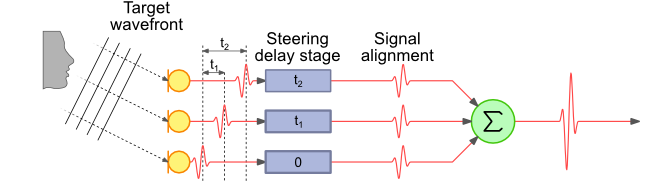

# 第二章

　　麦克风阵列技术的开始就是声源定位技术，只有通过声源定位得到声波到达时延信息或者说其中蕴涵的位置/方位信息才能将多个麦克风的数据通过波束形成技术有效地整合在一起而后进行后续的处理。因此麦克风阵列的定位准确度对麦克风阵列的效果有极大地影响。麦克风阵列声源定位技术大体可分为三类：一、基于波束形成的方法；二、基于子空间的方法；三、基于时延估计的定位方法。下面介绍各类定位技术的基本原理。

## 1.基于可控波束形成的声源定位技术

　　波束形成是阵列处理中一类重要技术,它通过加强特定方向传播信号的能量来修正阵列波束方向。单组阵列波束形成器通过搜索整个空间来确定能量最大的波束,从而估计出声源波达方向,而两组阵列的传播方向相交,就可以估计出声源位置。基于可控波束形成的定位算法,主要有延迟求和波束形成和自适应滤波求和波束形成方法。

### 1.1.延时求和波束形成声源定位

　　我们设麦克风数目为 $$M$$ ,第 $$m$$ 个麦克风接收信号为 $$x_m(n)$$ ，信号到达麦克风的时延为 $$\tau_m$$ ，各路麦克风接受信号的增益相同，干扰噪声在统计上相互独立，那么我们可以对语音信号 $$s(n)$$ 进行如下的合理估计：

$$
s(n)=\frac{1}{M}\sum_{m=1}^Mx_m(n+\tau_m)
$$

　　这即是最简单的延时求和波束形成器,又称固定波束形成器。它仅仅根据时间延迟对阵列信号进行时间校正,以补偿语音信号由声源到达不同麦克风所产生的延时,延时一求和波束形成器如图所示。

　　自然而然，我们想到在时域上的运算过于繁琐，可以将该延时求和波束形成器转换成频域形式进行处理计算。设声源到阵列的辐射角为 $$\theta$$ ，则方向矢量 $$A(k,\theta)=[1,e^{j2\pi k\tau_1(\theta)},e^{j2\pi k\tau_2(\theta)},...,e^{j2\pi k\tau_M(\theta)}]$$ 。示意图如下：

