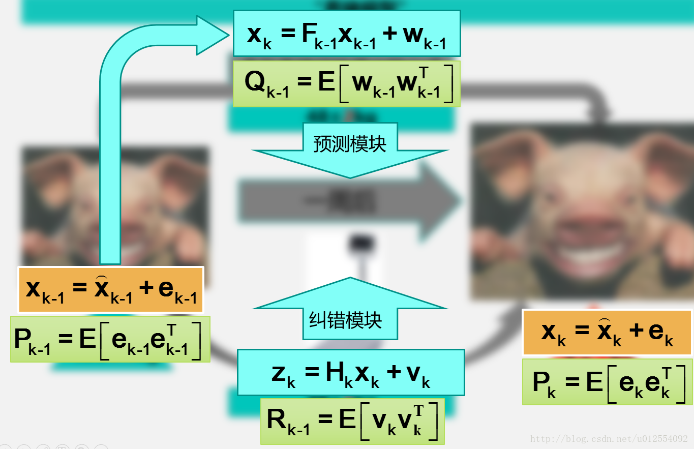
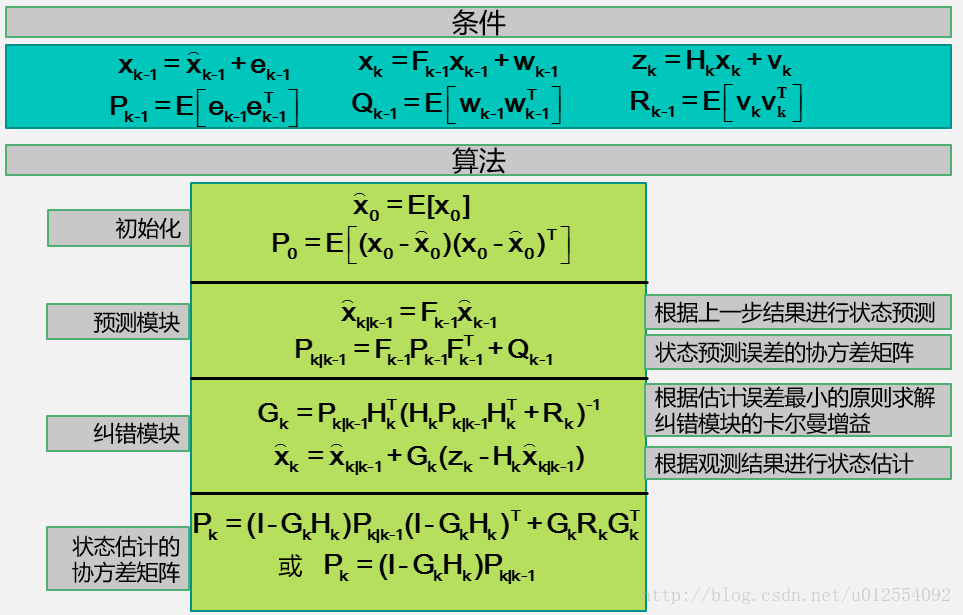
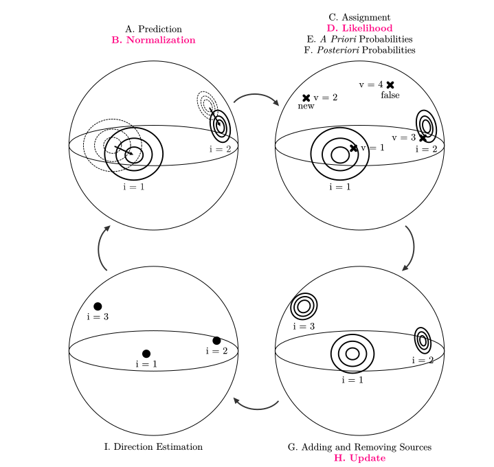

# 第三章

　　　为了提高声源定位的鲁棒性，我们必须对声源位置进行追踪，为之后对时延，方位信息强依赖的波束形成过程提供保证，我们引入一些方法对声源位置进行追踪。比如说卡尔曼滤波，粒子滤波等。

## 1.卡尔曼滤波器进行声源位置追踪

　　定位跟踪时，可以通过某种定位技术得到一个位置估计（观测位置），也可以根据我们的经验（运动目标常常是匀速运动的）由上一时刻的位置和速度来预测出当前位置（预测位置）。把这个观测结果和预测结果做一个加权平均作为定位结果，权值的大小取决于观测位置和预测位置的不确定性程度，在数学上可以证明在预测过程和观测过程都是线性高斯时，按照卡尔曼的方法做加权是最优的。

　　然而在有些应用中，如果不是线性高斯的情况该怎么办？可以采用EKF（扩展卡尔曼滤波），在工作点附近对系统进行线性化，即使不是高斯也近似成高斯去做。这样做有点太粗糙了，于是又有了IEKF（迭代卡尔曼滤波，对工作点进行迭代优化），UKF或SPKF（无迹卡尔曼滤波，不做线性化，而是投影做出一个高斯分布去近似）。或者抛弃各种假设，直接采用蒙特卡洛的方式，假设出很多的粒子去近似分布，就是PF（粒子滤波）。（其实粒子滤波的内核思想和卡尔曼滤波是类似的，但为了更广阔的适用性其抛弃了线性高斯前提，用大量粒子进行模拟近似分布）

　　这里先使用卡尔曼滤波进行说明。在进行说明之前，我们应当了解到卡尔曼滤波可以被用于什么场景下。你可以在任何含有不确定信息的动态系统中使用卡尔曼滤波，对系统下一步的走向做出，即使有根据的预测伴随着各种干扰，卡尔曼滤波总是能指出真实发生的情况。举个例子，假设我养了一只猪：

　　一周前，这只猪的体重是46±0.5kg。注意，在这里我用了±0.5，表示其实我对这只猪一周前的体重并不是那么确定的，也就是说，46kg这个体重有0.5kg的误差。现在，我又养了这只猪一个星期。那么我想要知道它一个星期之后多重，又大概有多少的误差？

　　为了得到一周后的体重，我有两种方法：一是根据我多年的养猪经验得到的猪体重公式推求出一个大概的值，另一个就是直接去称它的体重。当然，两种方法都有一定的误差。假设经验公式得到的体重是48kg，误差2kg；直接称体重得到的是49kg，误差1kg：

　　可是，不管是经验公式得到的值，还是直接称量得到的值，我都觉得不够准。我希望有一种方法，可以同时结合这只猪一周前的体重、用经验公式估计的值以及直接称量得到的值，综合考虑，得出一个最接近猪真实体重的，误差最小的值。这就是卡尔曼滤波要完成的任务。现在我们来把养猪的模型抽象成数学公式：



　　上图的左边，上一周的猪的体重，可以抽象为 $$k-1$$ 时刻的状态值，用 $$k-1$$ 时刻的最优估计值加上一个误差项来表示，右边同理。其中： $$P_k=E[e_ke_k^T]$$ 表示的是估计值的协方差。图中右边表示k时刻的状态值，这个值通过预测模块（也就是根据经验公式估计猪的体重）和纠错模块（也就是直接去称量猪的体重值）来估计。同样，预测模块和纠错模块都有着对应的误差和误差协方差矩阵。卡尔曼滤波要做的，就是根据贝叶斯估计的相关理论，同时考虑预测模块和纠错模块的协方差，对误差小的项赋予较大的权重，对误差大的项赋予较小的权重，并使预测的误差最小。 　　  
　　在连续变化的系统中使用卡尔曼滤波是非常理想的做法，它具有占用内存小的优点（除了前一个状态量外，不需要保留其它历史数据），并且速度很快，很适合应用于实时问题和嵌入式系统。

　　卡尔曼追踪原理基本思想是两个过程，一个预测过程，一个更新过程（纠错模块）。



　　这次我们描述一个较复杂的问题，三维声源位置信息的追踪。在时间 $$k$$ ，声源位置为 $$x_k$$。我们给定一个向量 $$\hat {x_k} = (\vec {p}, \vec {v})$$ 。其中一个为位置，一个为速度。由于是三维位置速度信息， $$\hat {x_k} $$ 是一个长度为六的向量。前三项是位置，后三项是速度。对位置的更新如下：

$$
\hat{x}_k=\left[\begin{matrix}1\quad0\quad0\quad\Delta t\quad0\quad0\\0\quad1\quad0\quad0\quad\Delta t\quad0\\0\quad0\quad1\quad0\quad0\quad\Delta t\\0\quad0\quad0\quad1\quad0\quad0\\0\quad0\quad0\quad0\quad1\quad0\\0\quad0\quad0\quad0\quad0\quad1\end{matrix}\right]*\hat{x}_{k-1}=F_k\hat{x}_{k-1}
$$

　　这个代表的是声源位置的经验预测值。相对应的，这个状态对应的协方差矩阵应该表现如下:

$$
P_k=F_kP_{k-1}F_k^T
$$

　　然后考虑到除了系统自身状态的影响，还有可能存在外在因素对系统进行控制。在我们的声源定位模型中，没有已知的外部控制量控制，即使有变化也是未知的。因此我们只能让这部分被认为是系统自身的变化。除此之外，协方差上也会存在未知的干扰，我们将这些没有被追踪到的干扰当做协方差为 $$Q_k$$ 的噪声来处理，其均值为零。这样就得到了当前状态的预测值 $$\hat{x}_k$$ 和协方差矩阵 $$P_k$$ ，表达式如下：

$$
\hat{x}_k=F_k\hat{x}_{k-1}\\P_k=F_kP_{k-1}F_k^T＋Q_k
$$

　　结合起来，我们就得到了卡尔曼滤波器的预测过程。从这里可以看到，新的最优位置估计是由上一最优位置估计得到的\(是修正后的结果\)，新的不确定性由上一不确定性（协方差）预测得到，并且加上外部环境的干扰。

　　接下来是卡尔曼滤波器的更新过程。我们要想到的是，仅仅预测是不够准确的，放在我们的模型中，就是用当前时刻的声源定位位置信息对用上一最优位置估计出这一时刻的预测值进行修正。

　　在定位中，我们必须考虑到的是我们的声源定位得到的位置信息的数据单位和尺度和我们跟踪的状态变量可能不一致。我们使用 $$H_k$$ 来修正这一不一致。考虑到卡尔曼滤波是基于高斯分布假设，这样可以得到其表述过程如下\(这里的是预测值转化为高斯分布的均值/方差的过程\)：

$$
\overrightarrow{\mu}_{expected}=H_k\hat{x}_k
\\\sum_{}._{expected}=H_kP_kH_k^T
$$

　　再来考虑观测值，由于声源定位过程中的不可避免地会出现很多误差，我们将总的不确定性用协方差 $$R_k$$ 表示，然后观测值状态变量的均值就是我们读取到的声源定位数据。状态不同，协方差亦不同。这个状态分布的均值就是我们声源定位过程中得到的定位数据 $$z_k$$ \(这个相当于是刚刚养猪例子中用体重秤量得的数据\)。

　　此时我们有了两个描述当前时刻声源位置状态的量。化为高斯分布，一个是预测值均值 $$\vec{\mu}_{expected}=H_k\hat{x}_k$$ ，方差为 $$\sum_{}._{expected}=H_kP_kH_k^T$$ 。一个是测量值均值 $$\vec{z_k}$$ ，方差为 $$R_k$$ 。这是两个高斯分布。

　　然后我们如何通过这两个高斯分布状态量得到最优估计呢？当前状态的最优估计是重叠部分的均值，也就是给定已知的所有信息中的最优估计。把两个具有不同均值和方差的高斯分布相乘，我们得到一个新的具有独立均值和方差的高斯分布，这是高斯分布的融合性。高斯分布的融合后的结果就是我们想要的最优估计。融合高斯分布的过程表示如下：

$$
N(x,\mu_0,\sigma_0) = \frac{1}{\sigma_0\sqrt{2\pi}}e^{-\frac{(x-\mu_0)^2}{2\sigma_0^2}}\\N(x,\mu_1,\sigma_1) = \frac{1}{\sigma_1\sqrt{2\pi}}e^{-\frac{(x-\mu_1)^2}{2\sigma_1^2}}\\N(x,\mu_0,\sigma_0)* N(x,\mu_1,\sigma_1) = N(x,\mu^{'},\sigma^{'})
$$

　　融合出的结果中， $$\mu^{'}$$ 和 $$\sigma^{'}$$ 为：

$$
\mu^{'}=\mu_0+\frac{\sigma_0^2(\mu_1-\mu_0)}{\sigma^2_0+\sigma_1^2}\\\sigma^{'2}=\sigma^2_0-\frac{\sigma_0^4}{\sigma^2_0+\sigma^2_1}
$$

　　然后为了运算方便，我们可以假设 $$k = \frac{\sigma_0^2}{\sigma_0^2+\sigma^2_1}$$ 。

$$
\mu^{'}=\mu_0+k(\mu_1-\mu_0)\\ \sigma^{{'}2}=\sigma_0^2-k\sigma_0^2
$$

　　为了格式统一，适应多变量的情形，我们将上面的变换写成矩阵的形式。如果 $$\sum$$ 表示高斯分布的协方差， $$\vec \mu$$ 表示每个维度的均值，则有如下表示：

$$
K=\sum._{0}(\sum._{0}+\sum._{1})^{-1}\\
\vec{\mu^{'
}}=\vec {\mu_0}+K(\vec{\mu_1}-\vec{\mu_0})\\
\sum.^{'}=\sum ._0-K\sum._0
$$

　　此处的K就是卡尔曼增益。

　　两个高斯分布分别为：预测部分 $$(\mu_0,\sum._0)=(H_k\hat x_k,H_kP_kH_k^T)$$ 和测量部分 $$(\mu_1,\sum_1)=(\vec z_k,R_k)$$ 。带入上边的矩阵表达我们可以得到：

$$
H_k\hat x_k^{'}=H_k\hat x_k+K(\vec{z_k}-H_k\hat{x}_k)\\
H_kP_k^{'}H_k^T=H_kP_kH_k^T-KH_kP_kH_k^T\\
K=H_kP_kH_k^T(H_kP_kH_k^T+R_k)^{-1}
$$

　　进行形变我们可以得到：

$$
\hat x^{'}_k=\hat x_k+K^{'}(\vec{z_k}-H_k\hat x_k)\\
P^{'}_k=P_k-K^{'}H_kP_k\\
K^{'}=P_kH_k^T(H_kP_kH_k^T+R_k)^{-1}
$$

　　这里是完整的更新步骤。 $$\hat x^{'}_k$$ 是新的最优估计，我们会将其和 $$P_k^{'}$$一起放到下一个预测和更新方程中不断迭代。但有些时候我们仍会觉得这样的卡尔曼滤波不够准确。因此可以做一些改进。

　　我们注意到在声源定位过程中为了将方位表示统一，我们需要对方位坐标做归一化处理。因此在卡尔曼滤波的预测迭代过程中我们也需要对我们预测和更新所得到的方位结果进行归一化。而对速度信息的处理亦然，准则是速度与球面相切。（准确的说应为角动量），是为了和位置信息的变化在同一尺度下而做这样的处理。过程如下：

```c
        xx = kalman->x_llm1->array[0*(kalman->x_llm1->nCols)+0];
        xy = kalman->x_llm1->array[1*(kalman->x_llm1->nCols)+0];
        xz = kalman->x_llm1->array[2*(kalman->x_llm1->nCols)+0];
        vx = kalman->x_llm1->array[3*(kalman->x_llm1->nCols)+0];
        vy = kalman->x_llm1->array[4*(kalman->x_llm1->nCols)+0];
        vz = kalman->x_llm1->array[5*(kalman->x_llm1->nCols)+0];
        printf("xx %f xy %f xz %f vx %f vy %f vz %f\n",xx,xy,xz,vx,vy,vz);
        norm2 = xx*xx + xy*xy + xz*xz;
        norm = sqrtf(norm2);
        proj = xx*vx + xy*vy + xz*vz;
        printf("norm2 %f norm %f proj %f\n",norm2,norm,proj);
        //归一化位置和速度信息计算（卡尔曼预测过程中）
        kalman->x_llm1->array[0*(kalman->x_llm1->nCols)+0] = xx / (norm + obj->epsilon);
        kalman->x_llm1->array[1*(kalman->x_llm1->nCols)+0] = xy / (norm + obj->epsilon);
        kalman->x_llm1->array[2*(kalman->x_llm1->nCols)+0] = xz / (norm + obj->epsilon);
        kalman->x_llm1->array[3*(kalman->x_llm1->nCols)+0] = vx - xx * proj / (norm2 + obj->epsilon);
        kalman->x_llm1->array[4*(kalman->x_llm1->nCols)+0] = vy - xy * proj / (norm2 + obj->epsilon);
        kalman->x_llm1->array[5*(kalman->x_llm1->nCols)+0] = vz - xz * proj / (norm2 + obj->epsilon);

```

　　同时为了防止数值溢出，归一化过程中给分母添加了一最小量，确保数据不会溢出。更直观的用公式表示：

$$
\\
\hat x=\left[\begin{matrix}xx\\yy\\zz\\vx\\vy\\vz \end{matrix}\right]\\
\hat x_{norm}=\left[\begin{matrix} \frac{xx}{\sqrt{xx^2+xy^2+xz^2}}\\\frac{xy}{\sqrt{xx^2+xy^2+xz^2}}\\\frac{xz}{\sqrt{xx^2+xy^2+xz^2}}\\vx-\frac{xx*(xx*vx+xy*vy+xz*vz)}{xx^2+xy^2+xz^2}\\vy-\frac{xy*(xx*vx+xy*vy+xz*vz)}{xx^2+xy^2+xz^2}\\vz-\frac{xz*(xx*vx+xy*vy+xz*vz)}{xx^2+xy^2+xz^2}\end{matrix}\right]
$$

　　这种归一化的操作实际上违反了卡尔曼滤波的基本假设，即所有的过程都是符合高斯的，并且系统是线性的。然而，在实践中，卡尔曼滤波方法仍然有效，因为这种归一化仅涉及方向和速度上的微小扰动，这使得操作带来的非线性部分可以忽略不计。与此同时一定程度上可以规避由于在定位过程中声源位置的不稳定在后面的更新过程中带来的非线性因素。

　　考虑到我们需要解决的问题是多目标追踪卡尔曼滤波，我们需要一种方法来保证卡尔曼滤波跟踪的轨迹跟踪的是正确的声源。即ID问题。同时也需要考虑追踪的开始和结束。用一张图来说明这个较复杂的过程：



　　我们注意到改进主要是在预测和更新过程中加入了归一化，ID交换，可能性和先验后验概率的计算，以及声源的状态确认。刚刚就是定位信息的归一化过程了。这里借代码分析后面的过程：

```c
void kalman2coherence_process(kalman2coherence_obj * obj, const kalman_obj * kalman, const pots_obj * pots, const unsigned int iTrack, coherences_obj * coherences) {

        unsigned int iPot;
        float B1, B2, B3, B4;
        float weight;

        // Compute mu_t
        matrix_mul(obj->mu_t, obj->H, kalman->x_llm1);
        matrix_transpose(obj->mu_t_t, obj->mu_t);        

        // Compute sigma_t
        matrix_mul(obj->HP, obj->H, kalman->P_llm1);
        matrix_mul(obj->sigma_t, obj->HP, obj->Ht);
        matrix_add(obj->sigma_t_epsilon, obj->sigma_t, obj->sigma_epsilon);

        // Compute sigma_t^-1
        matrix_inv(obj->sigma_t_inv, obj->sigma_t_epsilon);

        // Compute sigma_t^-1 * mu_t
        matrix_mul(obj->sigma_t_inv_mu_t, obj->sigma_t_inv, obj->mu_t);

        // Compute B3
        matrix_mul(obj->mu_t_t_sigma_t_inv_mu_t, obj->mu_t_t, obj->sigma_t_inv_mu_t);
        B3 = obj->mu_t_t_sigma_t_inv_mu_t->array[0*(obj->mu_t_t_sigma_t_inv_mu_t->nCols)+0];

        for (iPot = 0; iPot < pots->nPots; iPot++) {

            // Compute mu_s
            obj->mu_s->array[0*(obj->mu_s->nCols)+0] = pots->array[iPot*4+0];
            obj->mu_s->array[1*(obj->mu_s->nCols)+0] = pots->array[iPot*4+1];
            obj->mu_s->array[2*(obj->mu_s->nCols)+0] = pots->array[iPot*4+2];
            matrix_transpose(obj->mu_s_t, obj->mu_s);    
           
            // Compute sigma_st^-1
            matrix_add(obj->sigma_st_inv, obj->sigma_s_inv, obj->sigma_t_inv);

            // Compute sigma_st
            matrix_inv(obj->sigma_st, obj->sigma_st_inv);

            // Compute sigma_s^-1 * mu_s
            matrix_mul(obj->sigma_s_inv_mu_s, obj->sigma_s_inv, obj->mu_s);

            // Compute (sigma_t^-1 * mu_t + sigma_s^-1 * mu_s)
            matrix_add(obj->sigma_t_inv_mu_t_sigma_s_inv_mu_s, obj->sigma_t_inv_mu_t, obj->sigma_s_inv_mu_s);

            // Compute mu_st = sigma_st * (sigma_t^-1 * mu_t + sigma_s^-1 * mu_s)
            matrix_mul(obj->mu_st, obj->sigma_st, obj->sigma_t_inv_mu_t_sigma_s_inv_mu_s);
            matrix_transpose(obj->mu_st_t, obj->mu_st);     

            // Compute B1
            B1 = logf(matrix_det(obj->sigma_st)) - logf(8.0f * M_PI * M_PI * M_PI * matrix_det(obj->sigma_t) * matrix_det(obj->sigma_s));

            // Compute B2
            matrix_mul(obj->sigma_st_inv_mu_st, obj->sigma_st_inv, obj->mu_st);
            matrix_mul(obj->mu_st_t_sigma_st_inv_mu_st, obj->mu_st_t, obj->sigma_st_inv_mu_st);
            B2 = obj->mu_st_t_sigma_st_inv_mu_st->array[0*(obj->mu_st_t_sigma_st_inv_mu_st->nCols)+0];

            // Compute B4
            matrix_mul(obj->mu_s_t_sigma_s_inv_mu_s, obj->mu_s_t, obj->sigma_s_inv_mu_s);
            B4 = obj->mu_s_t_sigma_s_inv_mu_s->array[0*(obj->mu_s_t_sigma_s_inv_mu_s->nCols)+0];

            // Compute weight
            weight = expf(0.5f * (B1+B2-B3-B4));

            coherences->array[iTrack * pots->nPots + iPot] = weight;

        }

    }
```

　　需要注意到是，这里计算的并不是卡尔曼滤波过程中的卡尔曼增益，而是在计算潜在声源和定位点之间的相关性。得到的是一个比例因子。而这个过程中实际计算出的比例因子也只是mixture2mixture过程中用到的一个参数。下面详细说明这个过程：

　　考虑到我们进行的是多目标追踪的卡尔曼滤波，因此不能直接从潜在声源中得到追踪的目标，每一帧都需要选择使用潜在声源中哪一个定位点进行跟踪。我们设定一个配对函数： $$f_g(v)\in\{-2,-1,1,2,...,I\}$$ 。其中， $$-2$$ 表示潜在声源是一个错误方向， $$-1$$ 表示一个新的声源。 $$1,2,...,I$$ 表示先前跟踪的源。 $$I$$ 表示我们正在跟踪多少个声源。这就意味着如果我们同时存在 $$V$$ 个潜在声源，这些声源每个都有 $$I+2$$ 个可能值。因此存在 $$(I+2)^V$$ 种可能的排列。

　　思考我们测量出的潜在声源信息。其中包含方位信息和能量水平 $$\Lambda_v^l$$ 。其中能量水平 $$\Lambda_v^l$$代表了声源的活性。当一个声源属于激活状态时，其状态描述为 $$active(\mathcal A)$$。意味着这种情况下是声源发声。 那么我们可以得到一个高斯分布： $$p(\Lambda_v^l|\mathcal A)=N(\Lambda^l_v|\mu_{\mathcal A},\sigma_{\mathcal A})$$ ，这个高斯模型描述了能量等级在状态为激活时是何值以及其可能性。就是指在状态为激活的情况下能量等级的值和其概率的分布。同理，当声源处于未激活状态时，有 $$p(\Lambda_v^l|\mathcal I)=N(\Lambda^l_v|\mu_{\mathcal I},\sigma_{\mathcal I})$$ 。要注意到的是这是一个估计。同时为了符合实际，两个高斯分布的方差应为相同的，同时激活状态高斯分布的均值应该大于未激活状态的高斯分布的均值。\(激活状态的能量大于未激活状态\)。

　　与此同时，潜在声源 $$\lambda_v^l$$ 被判定为跟踪声源的概率可以用如下的体积积分算出（因为这是一个三维的分布，所以是三重积分）：

$$
p(\lambda_v^l|\mathcal C_i)=\int \int \int p(\lambda^l_v|(d')^{l|l-1}_i)p((d')^{l|l-1}_i)dxdydz
$$

　　这里的 $$\mathcal C_i$$ 代表的是一个在空间中特定方向的相关的声源，在卡尔曼滤波的假设中，追踪声源方位概率 $$p((d')^{l|l-1}_i)$$ 符合以下的高斯分布：

$$
(d')^{l|l-1}_i ～\mathcal N(\mu_i^l,\sum_i^l)\\
\mu_i^l=\vec H(\hat x')_i^{l|l-1}\\
\sum^l_i=\vec H \vec P_i^{l|l-1}\vec H^T
$$

 　　在给出追踪声源方位概率 $$(d')^{l|l-1}_i$$ 后，我们就可以得到潜在声源 $$\lambda_v^l$$ 作为观测值的可能性： $$\lambda_v^l|(d')_i^{l|l-1}～\mathcal N((d')^{l|l-1}_i,R)$$ 。

　　这个时候我们要注意到一个小技巧：在交换均值 $$\lambda_v^l$$ （潜在声源方向）和随机变量 $$(d')_i^{l|l-1}$$ （上一次的最优估计方位）后，我们得到的是相同的概率密度函数。

