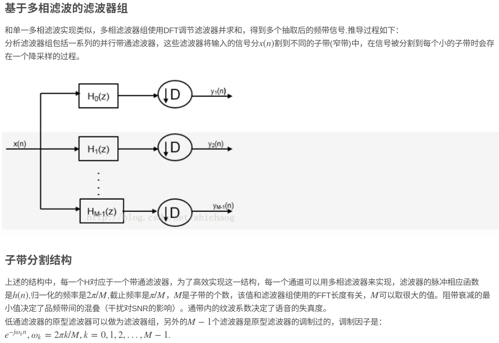
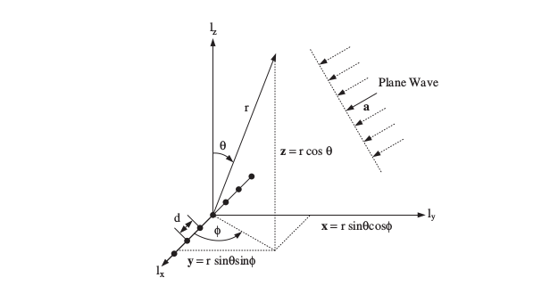
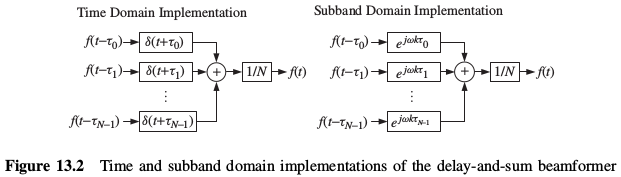
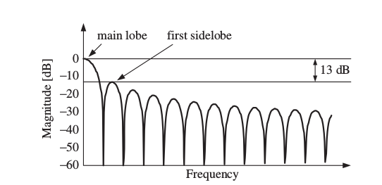

# 第四章

        Beamforming,波束形成。前面我们介绍了如何对声源位置进行确认和追踪，但我们应该通过什么方式对我们所关注的目标方向的声音信息进行增强呢？答案就是波 束形成技术。无论是什么形式的波束形成，其效果总是通过几个麦克风的信号组合来加强目标方向声源信息和抑制来自其他方向的干扰信号。那么这一效果是通过什么方式方法进行实现的呢？下面将为大家一一介绍。

## 1.波束形成基本原理与概念

### 1.1声音的传播和阵列几何位置（同时也涉及到多相滤波，subband的一些概念）

        我们首先来思考一个具有 $$N$$ 个传感器的随机形状的阵列。 我们假设这 $$N$$ 个传感器的坐标 $$\vec m_n$$ 全部已知， $$n=0,1,...,N-1$$ 。传感器接收到的信号可以表示如下：

$$
\vec f(t,\vec m)=\left[\begin{aligned}f(t,\vec m_0)\\
f(t,\vec m_1)\\
.\quad\quad\\
.\quad\quad\\
f(t,\vec m_{N-1})\end{aligned}\right]
$$

        现在要注意到我们假定是在连续时域 $$t$$ 上进行处理。这是为了避免由于离散时间而导致的间隔。但是这个问题在我们将宽带波束在分割为窄带变为不同子带域的时候会消失。因为我们在子带域中应用的相移和比例因子是连续的值，不管开始的信号是否是这样。每个麦克风的输出是通过一个线性时不变滤波器和冲击响应 $$h_n(\tau)$$ 进行滤波求和输出的。

$$
y(t)=\sum_{n=0}^{N-1}\int_{-\infty}^{\infty}h_n(t-\tau)f_n(\tau,\vec m_n)d\tau
$$

        在矩阵形式中，延迟求和滤波器传感器\(麦克风\)权重可被表示如下：

$$
y(t)=\int_{-\infty}^{\infty}\vec h^T(t-\tau)\vec f(\tau,\vec m)d\tau
$$

        其中

$$
\vec h(t)=\left[\begin{aligned}h_0(t)\\
h_1(t)\\
{.}{\quad}\\
{.}{\quad}\\
h_{N-1}(t)\end{aligned}\right]
$$

        使用连续时间傅里叶变换转移到频域上可以重写为：

$$
Y(\omega)=\int^{\infty}_{-\infty}y(t)e^{-j\omega t}dt=\vec H^T(\omega)\vec F(\omega,\vec m)
$$

        注意这里的分解 $$Y(\omega)=\vec H^T(\omega)\vec F(\omega,\vec m)$$ 类似于时域上的形式，其分别可以写为

$$
\vec H(\omega)=\int^{\infty}_{-\infty}\vec h(t)e^{-j\omega t}dt\\
\vec F(\omega,\vec m)=\int^{\infty}_{-\infty}\vec f(t,\vec m)e^{-j \omega t}dt
$$

        他们分别是滤波器的频率响应矢量和麦克风信号的频谱。

        \(下面这里看起来比较复杂，其实是将宽带信号分割为窄带再还原回去的过程\)在构建一个实际的波束形成系统时，我们是不能使用上面使用的连续时间傅里叶变换的。相对应的，是对每个麦克风的输出进行采样然后进入（傅里叶）分析滤波器组进行处理，产生一组子带。这些样本是中心频率为 $$\omega_m=2\pi m/M$$ 的 $$N$$ 个样本，其中 $$M$$ 是子带的数目。然后依次相加然后求内积。！这个地方可能有疑问，如下：

低通滤波器的原型滤波器做为滤波器组，另外 $$M-1$$ 个滤波器原型滤波器的调制，调制因子是 $$e^{-j\omega_m n},\omega_m=2\pi m/M,m=1,2,3...,M$$ 对应刚刚的中心频率。然后所有 $$M$$ 个波束形成器的输出可以由合成滤波器组转化回时域。其中分析滤波器组只有在满足信号的采样足够频繁满足奈奎斯特准则的时候才可以看做是采样信号的短时傅里叶变换，（详细过程见滤波器组章节描述）子带频域上的波束形成有很大的优点，主动传感器权重可以独立地针对每个子带优化。这样处理的好处是相对于相同长度的时域滤波求和波束形成节省了很大的运算量。一个简单的滤波器组的了解可以参考这两篇文章：1.（[https://blog.csdn.net/shichaog/article/details/77379998](https://blog.csdn.net/shichaog/article/details/77379998)）。2.（[https://blog.csdn.net/book\_bbyuan/article/details/80366196](https://blog.csdn.net/book_bbyuan/article/details/80366196)），详细了解建议参考《distantspeechrecognition》中的第十一章。

        另外值得一提的是虽然滤波器频率响应在上面的式子中表示为随时间变化的常数，但是在随后的部分中，这个假设将会被释放， $$H(\omega)$$ 将会变为自适应的来进行最大或最小的优化准则。但在这种情形下，自适应滤波理论需要这样的一个假设： $$H(\omega)$$ 的变化速率足够慢，这样的话单个子带快照持续时间对应的 $$H(\omega)$$ 是不变的符合我们的公式。但这也意味这系统不再是线性系统。

        后面的描述里，我们使用球面坐标系 $$(r,\theta,\phi)$$ 来描述声波在空间中的传播。这个坐标和标准笛卡尔坐标系 $$(x,y,z)$$ 的关系如下图所示。

        其中 $$r \geq 0$$ 代表半径或者范围，极角 $$\theta$$ 符合 $$0\leq \theta \leq \pi$$ 。方位角 $$\phi$$ 符合 $$0\leq \phi \leq 2\pi$$ 。但要注意到的是，在圆形阵列情况下，方位角 $$\phi$$ 符合 $$0\leq \phi \leq 2\pi$$ 是没有问题的。但是在线性阵列下，由于对称性，方位角 $$\phi$$ 符合 $$0\leq \phi \leq \pi$$ 而不是 $$0\leq \phi \leq 2\pi$$ 。

        在经典的阵列处理文献中，声波是平面波是很常见的假设，这意味着波的来源是远点，即符合远场假设。其实这种假设在通过空气的声波束成形中并不为真，因为阵列的孔径通常与从源到传感器的距离具有相同的数量级。但这个假设仍然是非常有必要的，其一是简化了许多在近场模型中的重要概念，其二是在实践中并非总是能可靠的估计从源到传感器的距离。在这种情况下，平面波假设是唯一的可能选择。

        考虑如下的一个平面波：

$$
\vec a=\left [\begin{aligned}a_x\\a_y\\a_z \end{aligned}\right]=\left [\begin{aligned}-sin\theta cos\phi\\-sin\theta sin\phi\\-cos\theta\quad \end{aligned}\right]
$$

        这个平面波的第一个产物的简化是一个相同的信号 $$f(t)$$ 到达每个传感器但不是同时到达的一个简写。如下：

$$
\vec f(t,\vec m)=\left[\begin{aligned}f(t-\tau_0)\\f(t-\tau_1)\\f(t-\tau_2)\\.\quad\quad\\f(t-\tau_{N-1})\end{aligned}\right]
$$

        其中到达时延\(TDOA\) $$\tau_n$$ 出现在上式中，其实是可以被内积计算出的\(几何方法计算\)：

$$
\tau_n=\frac{\vec a^T\vec m_n}{c}=-\frac{1}{c}[m_{n,x}\cdot sin\theta cos\phi +m_{n,y}\cdot sin\theta sin\phi +m_{n,z}\cdot cos\theta]
$$

        $$c$$ 是声音的速度， $$\vec m_n=[m_{n,x}\quad m_{n,y}\quad m_{n,z}]$$ 。每个时延 $$\tau_n$$ 代表着第 $$n$$ 个传感器到起点传感器的时延。现在我们定义方向余弦为

$$
\vec u \triangleq -\vec a
$$

        那么我们就可以得到\(这里就理解为啥在odas里会有负号了\)

$$
\tau_n=-\frac{1}{c}[u_xm_{n,x}+u_ym_{n,y}+u_zm_{n,z}]=-\frac{\vec u^T\vec m_n}{c}
$$

        连续时间傅立叶变换的时延特性意味着在信号模型下，刚刚定义的 $$F(\omega)$$ 的第 $$n$$ 分量可以是 表示为

$$
F_n(\omega)=\int^{\infty}_{-\infty}f(t-\tau_n)e^{j\omega t}dt=e^{-j\omega \tau_n}F(\omega)
$$

        其中的 $$F(\omega)$$ 是原始声源的傅里叶变换。从刚刚的推导中我们还可以得到：

$$
\omega\tau_n=\frac{\omega}{c}\vec a^T\vec m_n=-\frac{\omega}{c}\vec u^T\vec m_n
$$

        对于平面波在局部均匀介质中传播的情况，波数定义为

$$
\vec k=\frac{\omega}{c}\vec a=\frac{2\pi}{\lambda}\vec a
$$

        其中 $$\lambda$$ 是对应于角频率 $$\omega$$ 的波长。由此，波数可以表示为：

$$
\vec k=-\frac{2\pi}{\lambda}\left[\begin{aligned}sin\theta cos\phi\\sin\theta sin\phi\\cos\theta\quad \end{aligned}\right]=-\frac{2\pi}{\lambda}\vec u
$$

        假设声速可以表示为一个常数，那么

$$
|\vec k|=\frac{\omega}{c}=\frac{2\pi}{\lambda}
$$

        物理上，波数表示平面波的传播方向和频率。在上面波数的表达式中，矢量 $$\vec k$$ 定义出了平面波的传播方向。平面波的等式意味着 $$\vec k$$ 的大小决定了平面波的频率。由此，我们也得到了：

$$
\omega\tau_n=\vec k^T\vec m_n
$$

        因此，传播波的傅里叶变换的 $$n$$ 次分量可以表示为如下向量形式：

$$
\vec F(\omega)=F(\omega)\vec v_k(\vec k)
$$

        这里的 $$\vec v_k(\vec k)$$ 是阵列流形向量。表示如下：

$$
\vec v_k(\vec k)\triangleq \left[\begin{aligned}e^{-j\vec k^T\vec m_0}\\e^{-j\vec k^T\vec m_1}\\.\quad\\e^{-j\vec k^T\vec m_{n-1}}\end{aligned}\right]
$$

        这个表达式表示了阵列位置和传播波的交互作用的一个完整的缩写/摘要。正如前面提到的，波束形成通常在离散时间傅里叶变换域，通过使用数字滤波器组。这意味着在样本中必须指定时间偏移。在这种情况下，数组流形向量必须表示为：

$$
\vec v_{DT}(\vec x,\omega_m)\triangleq \left[\begin{aligned}e^{-j\omega_m\tau_0/T_s}\\e^{-j\omega_m\tau_1/T_s}\\.\quad\quad\\.\quad\quad\\e^{-j\omega_m\tau_{N-1}/T_s}\end{aligned}\right]
$$

        其中，窄带subband中心频率是 $$\{\omega_m\}$$ 。传播时延 $$\{\tau_n\}$$ 的计算如刚刚所示。 $$T_s$$ 是定义的采样间隔。

### 1.2波束方向特性

         这部分和第一章的内容有部分重叠。做一些说明即可。

         对数字信号处理的一些基础知识，我们证明了复指数序列 $$f[n]=e^{jwn}$$ 是任何数字线性时不变系统的特征序列。可以简单表示为：

$$
f(t)=e^{j\omega t}
$$

        这个简化是任何模拟信号的特征函数。这也意味着上述式子一样的复指数作为单输出单输入线性时不变系统的输入的话，这个系统的输出一定具有如下形式：

$$
y(t)=G(\omega)e^{j\omega t}
$$

        这个 $$G(\omega)$$ 是系统的频率响应。对于用于阵列过程的多输出单输入线性时不变系统，我们考虑如下形式的特征函数：

$$
f_n(t,\vec m_n)=exp[j(\omega t -\vec k^T\vec m_n)]
$$

         考虑到我们定义的是一个平面波，对于整个阵列，我们可以写出：

$$
\vec f(t,\vec m)=e^{j\omega t}\vec v_k(\vec k)
$$

        这个阵列对于平面波的响应可以表达为：

$$
y(t,\vec k)=\Upsilon(\omega,\vec k)e^{j\omega t}
$$

        由此，频率、波数响应函数可以表示如下；

$$
\Upsilon(\omega,\vec k)\triangleq\vec H^T(\omega)\vec v_k(\vec k )
$$

         与此同时， $$\vec H(\omega)$$ 是滤波器响应 $$\vec h(t)$$ 的傅里叶变换。正像是频率响应 $$H(\omega)$$ 制定了传统线性时不变系统对正弦输入的响应\( $$H(e^{j\omega})\triangleq \sum^{\infty}_{m=-\infty}h[m]e^{-j\omega m}$$ \)。频率-波数响应函数指定了阵列对具有波数 $$\vec k$$ 和角频率 $$\omega$$ 的平面的输出响应。观察公式 $$\Upsilon(\omega,\vec k)$$ ，发现冗余的是角频率 $$\omega$$ 是由波数 $$\vec k$$ 唯一指定的。但我们仍然保留了 $$\omega$$ ,为了强调频率-波数响应函数的频率依赖性。

        波束方向特性代表了阵列对具有波数 $$\vec k=\frac{2\pi}{\lambda}\vec a(\theta,\phi)$$ 的平面波的灵敏度。可以表示如下： $$B(\omega:\theta,\phi)\triangleq \Upsilon(\omega,\vec k)|_{\vec k=\frac{2\pi}{\lambda}\vec a(\theta,\phi)}$$ 。其中 $$\vec a(\theta,\phi)$$ 是一个有球面坐标角 $$\theta,\phi$$ 的单位向量。频率-波数响应函数和 波束方向特性的主要区别在于 波束方向特性中的参数必须与物理角度 $$\theta,\phi$$ 相对应。

        上面两个部分分别分析了传播波和麦克风阵列本身的性质。下面为了引入波束形成的概念，我们先来接触延迟求和滤波器。

### 1.3延迟求和滤波器

        在一个延迟求和滤波器中，此滤波器在每个传感器的脉冲响应是如下的相移脉冲

$$
h_n(t)=\frac{1}{N}\delta(t+\tau_n)
$$

        其中 $$\delta(t)$$ 是狄拉克delta函数。其中时延 $$\{\tau_n\}$$ 是根据 $$\omega\tau_n=\vec k^T\vec m_n$$ 计算出的，使得来自阵列的每个传感器的信号相干地相加在一起。我们从短期来看，这具有相对在其它方向上传播的波的增强我们所需平面波的效果，只要满足特定的条件。如果信号是具有中心频率 $$\omega_c$$ 的窄带信号，那么一个时延 $$\tau_n$$ 就对应于一个线性相移，使得用于第 $$n$$ 个传感器输出的复数权重可被如下表达：

$$
\omega^{*}_n=H_n(\omega_c)=\frac{1}{N}e^{j\omega_c\tau_n}
$$

        它的矩阵形式是

$$
\vec w^H(\omega_c)=\vec H^T(\omega_c)=\frac{1}{N}\vec v^H_k(\vec k)
$$

        阵列流形向量 $$\vec v_k(\vec k)$$ 在上面分别以连续和离散时间的形式给出定义。正如之前提过的，窄带假设在这个地方是适用的。我们会在这个地方加一个分析滤波器组从而使得每个传感器的输出分割成 $$M$$ 个子带信号。从子带分割的一些知识我们可以知道，滤波器组的原型设计是为了减小混叠失真，这也意味着其在阻带中会被很好地抑制。下图说明一下延时求和滤波器的时域和子带域实现：

        一个简单的离散傅立叶变换（DFT）也可以用于子带分析和再合成。然而，这种方法是次优的，因为它对应于具有原型脉冲响应且值恒定的均匀DFT滤波器组。这意味着阻带中将有大的旁瓣，如图所示。并且不同子带的输出处的复杂样本既不是统计独立的，也不是不相关的。  

         为了获得传感器阵列的表现评估，我们现在引入几个简化性假设。首先，我们考虑一个均匀线性的传感器阵列，其传感器位于：

$$
m_{n,x}=(n-\frac{N-1}{2})d,\quad m_{n,y}=m_{n,z}=0\quad \forall n=0,...,N-1
$$

        其中 $$d$$ 表示麦克风间距。为了进一步简化，假设平面波只在 $$x-y$$ 平面上传播，阵列流形就可以表示为

$$
\vec v_k(k_x)=[e^{j(\frac{N-1}{2})k_xd}...e^{j(\frac{N-1}{2}-1)k_xd}...e^{-j(\frac{N-1}{2})k_xd}]^T
$$

        其中定义 $$k$$ 的 $$x$$ 分量的定义如下

$$
k_x\triangleq -\frac{2\pi}{\lambda}cos\phi=-k_0cos\phi\\
k_0\triangleq|\vec k|=\frac{2\pi}{\lambda}
$$

        \(补充下波数的定义，[理论物理](https://baike.baidu.com/item/%E7%90%86%E8%AE%BA%E7%89%A9%E7%90%86/2490260)中定义为：k=2π/λ。意为2π长度上出现的全波数目。从[相位](https://baike.baidu.com/item/%E7%9B%B8%E4%BD%8D/2391710)的角度出发，可理解为：相位随距离的变化率（rad/m）。\)

        使用 $$u_x=cos\phi$$ 表示关于 $$x$$ 轴的方向余弦。然后进行如下定义：

$$
\psi\triangleq-k_xd=\frac{2\pi}{\lambda}cos\phi\cdot d=\frac{2\pi}{\lambda}u_x\cdot d
$$

        变量 $$\psi$$ 包含了所有重要的比率 $$d/\lambda$$ 和波达方向 $$u=u_x=cos\phi$$ 。因此 $$\psi$$ 是对需要的所有信息的简要总结而需要计算阵列的灵敏度。波数响应是 $$k_x$$的一个函数，可以表达成：

$$
\Upsilon(\omega,k_x)=\vec w^H \vec v_k(k_x)=\sum^{N-1}_{n=0}\omega^{*}_ne^{-j(n-\frac{N-1}{2})k_xd}
$$

        阵列流形向量可以表示为以下不同空间（ $$\phi,u,\psi$$ ）的表达形式：

$$
[\vec v_{\phi}(\phi)]_n=e^{j(n-\frac{N-1}{2})\frac{2\pi d}{\lambda}cos\phi}\\
[\vec v_u(u)]_n=e^{j(n-\frac{N-1}{2})\frac{2\pi d}{\lambda}u}\\
[\vec v_{\psi}(\psi)]_n=e^{j(n-\frac{N-1}{2})\frac{2\pi d}{\lambda}\psi}
$$

        其中 $$[\cdot]_n$$ 代表相关阵列流形向量的第 $$n$$ 个分量。给出上面这种表示beampattern是有很多原因的。首先，

