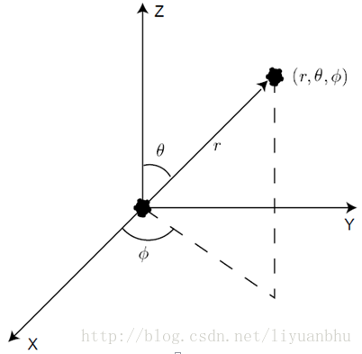
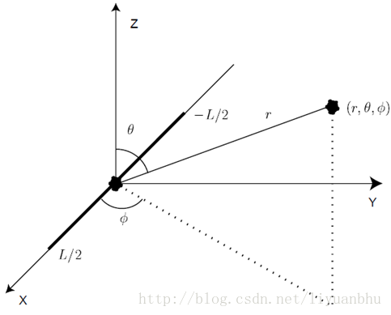

# 第一章

## 1.简介

　　这里主要描述麦克风阵列技术和波束形成理论的一些基础知识。所谓麦克风阵列就是放置在空间中不同位置的多个麦克风。根据声波传导的原理，利用多个麦克风收集到的信号可以将某一方向传来的声音增强或抑制。利用这种方法，麦克风阵列可以将噪声环境中特定声音信号有效的增强。更进一步来说，这种增强效应只依赖与声源所在的位置，对噪声的类型、频谱等没有特殊的要求，因此可以用在非常广的应用领域。由于麦克风阵列技术具有很好的抑制噪声的能力，又不需要麦克风时刻指向声源方向，因此在语音处理领域具有非常好的前景。

　　我们本章主要讨论以下三个问题，以此帮助理解整个阵列处理过程。　　

* 波传播
* 连续孔径
* 离散传感器阵列

## 2.波传播

　　声波在流体中以纵波形式存在。基于牛顿力学可以发展出一套描述波传播的数学方程。一个准确描述真实环境中波传播的波动方程非常的复杂，为了简化它，我们假设流体见无摩擦力，波动方程就可以简化为

$$
\Delta ^2x(t,\overrightarrow r)-\frac{1}{c^2}\frac{\delta ^2}{\delta t^2}x(t,\overrightarrow r)= 0
$$

　　上式中 $$x(t,\overrightarrow r）$$描述的是某一 t 时刻，空气中一点 r 处的声压。

$$
r = \left(\begin{matrix}x \\y\\z\end{matrix}\right)
$$

　　其中的 $$\Delta ^2$$ 是拉普拉斯算子，而我们要知道的是波的传播速度c，取决于流体的压力和密度，在空气中近似为330m/s。利用变量分离法可以推导出各种不同条件下波动方程的解。对单一频率的平面波，波动方程的解如下:

$$
x(t,\overrightarrow r)=Ae^{j(\omega t- \overrightarrow k\overrightarrow t)}
$$

　　在上式中，A为波的振幅，k为波的数目。这样，给出了波的传播方向和波速信息

$$
k=\frac{2\pi}{\lambda}[sin\theta cos\phi \quad sin\theta sin\phi \quad cos\phi]
$$

　　同时我们也知道的是波长 $$\lambda$$ 与 c 相关，且存在关系式 $$\lambda = c/f$$ .显然，对于球面波我们知道：

$$
x(t,\overrightarrow r)=-\frac{A}{4\pi r}e^{j(\omega t -kr)}
$$

　　其中 $$r = |\overrightarrow r|$$ 是源的径向距离，k 是标量波数，由 $$2\pi / \lambda$$ 给出。从球面波的解析式我们可以知道，信号幅度以与距离成正比的速率衰减，这种幅值对距离的依赖性对阵列具有重要的意义。因此在近场模型中，我们必须要考虑声源与阵列的距离，并要当做球面波进行求解。而对于远场模型，其距离已经比较远，信号幅度对距离的变化率也不是太大。同时其虽然从声波的产生机制来看几乎所有的声波都是球面波，但是当我们距离声源较远的时候我们可以将其近似为平面波，从而简化数学推导。

　　而之前的平面波中有两个自变量，时间和空间变量，由于信号的传播过程中时间和空间的相关性，这两个自变量可以形成一个整体。若我们将表达式写成：

$$
x(t,\overrightarrow r)=Ae^{j\omega(t-\overrightarrow \beta . \overrightarrow r)}
$$

　　再定义一个新的变量 $$u = t - \overrightarrow \beta . \overrightarrow r$$ ，则上式可以写为：

$$
x(u)=Ae^{j\omega u }
$$

　　而对于球面波，做变换 $$u = t - r/c$$ ，我们有更为简洁的表达式：

$$
x(u) = -\frac{A}{4\pi r}e^{j\omega u}
$$

　　而考虑到波动方程具有线性，上述单频率的解可以扩展为不同频率波动的叠加。更一般的情形下，解的形式应当是这样的复数指数的和或者积分形式。与此同时，傅里叶理论告诉我们，任何具有收敛的傅里叶积分的函数都可以表示为复指数的加权叠加，这样我们可以得到一个结论：任何具有有效傅里叶变换的信号，不管其形状如何，都满足波动方程。

　　从上面我们可以看出，声音信号的传播可以表达为一个单一变量函数，其变量是时间和空间的简单相关。此外，信号中的信息在传播时被保存。这两个结论意味着，对于带限信号，我们可以在空间和时间上重构信号通过如下两种方式：

* 在空间中某给定位置对信号进行时间采样
* 在给定的时间瞬间对信号进行空间采样

　　而第二种方式就是麦克风阵列信号处理的理论基础。也是泛用意义上孔径和传感器阵列信号处理的理论基础。总结后我们可以发现如下几个阵列信号的特点：

* 波的传播速度与介质的性质有关，包括其密度，温度，材质等等。对某种各种参数固定均匀的介质来说，波速是固定的。对于空气中传播的声波，波速近似为330m/s。
* 一般来说，波是以球面波的形式传播的，幅度与传播距离成反比，而远场下的情形传播距离影响变小，可以视为平面波进行处理。
* 波动方程满足叠加性，多个振源产生的波动可以互不干扰的独立传播。利用时间和空间信息，可以开发算法将这些波动分开。

　　为了简化问题，上面的讨论中假设介质是各项同性、无耗散的，同时忽略了色散、散射和波速的变化。

## 3.连续孔径

　　术语“孔径”是指发射或接受波的空间区域。发射孔径通常被称为主动孔径\(active aperture\)，接受孔径通常被称为被动孔径\(passive aperture\)。比如说，在光学，孔径可以是透明隔板上的一个孔。在电磁学中，孔径可以表示电磁天线。声学上，孔径则是一个将声信号转换为电信号的电声传感器\(麦克风\)或者是一个将电信号转换为声音信号的设备\(扬声器\)。

### 3.1.孔径函数

　　考虑一个体积为V的接受孔径， $$x(t,\overrightarrow r)$$ 表示在时间t和空间r处信号的值。考虑接收孔径在r处的一个无限小的体积dV的冲击响应为 $$a(t,\overrightarrow r)$$ ，那么接收到的信号可以用卷积表示

$$
x_R(t,\overrightarrow r)=\int_{-\infty}^{\infty}x(\tau,\overrightarrow r) a(t-\tau,\overrightarrow r)d\tau
$$

　　其频域表示为

$$
X_R(f,\overrightarrow r)=X(f,\overrightarrow r)A(f,\overrightarrow r)
$$

　　 $$A(f,\overrightarrow r)$$ 被称为孔径函数或sensitivity function,它给出了孔径上不同空间位置的响应函数。需要注意到的是上面讨论的是孔径上一特定点的响应，我们获得的信号是孔径上所有点响应的线性叠加。也就是其空间积分：

$$
y(t) =\int \int_V \int x_R(t,\overrightarrow r)dV
$$

### 3.2. Directivity Pattern

　　一个接收孔径的响应是有方向性的，因为对于不同方向传来的信号来说孔径所张开的立体角是不同的。图 1 给出了一维线性孔径接收平面波信号的图示。

　　孔径的响应是频率和入射方向的函数，被称为Directivity Pattern 或beam pattern。通过求解波动方程可以推导出，Directivity Pattern 与孔径函数为傅里叶变化关系。远场条件下接收孔径的Directivity Pattern可以表示为：

$$
D_R(f,\alpha)=F_r\{A_R(f,\overrightarrow r)\}\\=\int_{-\infty}^{\infty}A_R(f,\overrightarrow r)e^{j2\pi \overrightarrow \alpha . \overrightarrow r }d\overrightarrow r
$$

　　其中 $$F_r\{.\}$$ 是三维的傅里叶变换，

$$
\overrightarrow r =\left[\begin{matrix}x_\alpha \\y_\alpha\\z_\alpha\end{matrix}\right]
$$

　　 $$\overrightarrow r$$ 是点在孔径上的空间位置。

$$
\overrightarrow{\alpha}=\overrightarrow{f}\beta\\=\frac{1}{\lambda}[\quad sin\theta cos\phi \quad sin\theta sin\phi \quad cos\theta \quad]
$$

　　这是波的方向矢量， $$\theta$$ 和 $$\varphi$$ 含义如下图：

　　另外我们需要注意到的是上述方程中的频率与波长有依赖性 $$\lambda=c/f$$ 。

### 3.3.  线性孔径

　　为了获得Directivity Pattern的一些特性，我们把问题简化为沿着x轴方向的长度为L的一维线性孔径。如下图所述：

