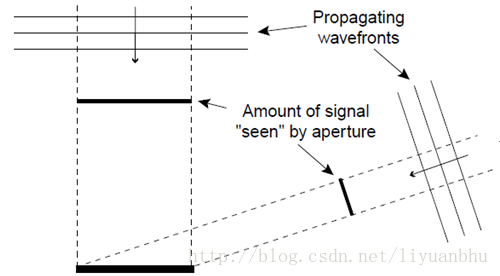
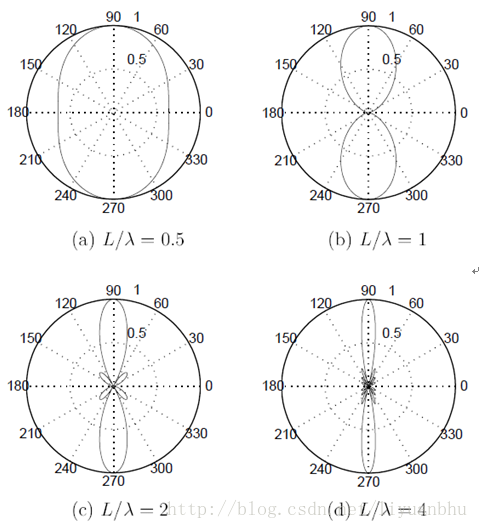
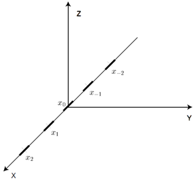
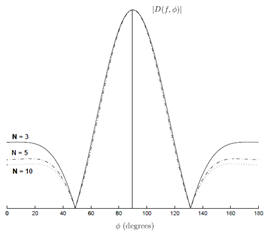
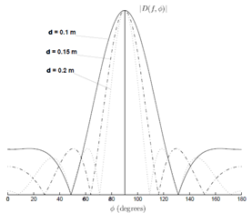
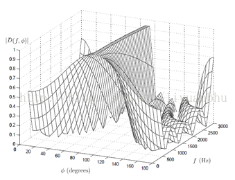
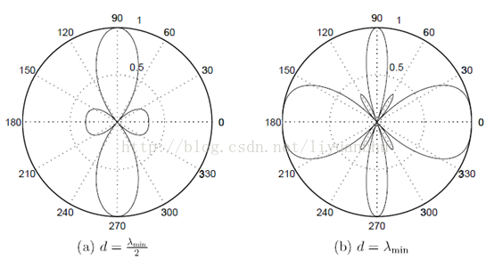

# 第一章

## 　　1.简介

　　这里主要描述麦克风阵列技术和波束形成理论的一些基础知识。所谓麦克风阵列就是放置在空间中不同位置的多个麦克风。根据声波传导的原理，利用多个麦克风收集到的信号可以将某一方向传来的声音增强或抑制。利用这种方法，麦克风阵列可以将噪声环境中特定声音信号有效的增强。更进一步来说，这种增强效应只依赖与声源所在的位置，对噪声的类型、频谱等没有特殊的要求，因此可以用在非常广的应用领域。由于麦克风阵列技术具有很好的抑制噪声的能力，又不需要麦克风时刻指向声源方向，因此在语音处理领域具有非常好的前景。

　　我们本章主要讨论以下三个问题，以此帮助理解整个阵列处理过程。　　

* 波传播
* 连续孔径
* 离散传感器阵列

## 2.波传播

　　声波在流体中以纵波形式存在。基于牛顿力学可以发展出一套描述波传播的数学方程。一个准确描述真实环境中波传播的波动方程非常的复杂，为了简化它，我们假设流体见无摩擦力，波动方程就可以简化为

$$
\Delta ^2x(t,\overrightarrow r)-\frac{1}{c^2}\frac{\delta ^2}{\delta t^2}x(t,\overrightarrow r)= 0
$$

　　上式中 $$x(t,\overrightarrow r）$$描述的是某一 t 时刻，空气中一点 r 处的声压。

$$
r = \left(\begin{matrix}x \\y\\z\end{matrix}\right)
$$

　　其中的 $$\Delta ^2$$ 是拉普拉斯算子，而我们要知道的是波的传播速度c，取决于流体的压力和密度，在空气中近似为330m/s。利用变量分离法可以推导出各种不同条件下波动方程的解。对单一频率的平面波，波动方程的解如下:

$$
x(t,\overrightarrow r)=Ae^{j(\omega t- \overrightarrow k\overrightarrow t)}
$$

　　在上式中，A为波的振幅，k为波的数目。这样，给出了波的传播方向和波速信息

$$
k=\frac{2\pi}{\lambda}[sin\theta cos\phi \quad sin\theta sin\phi \quad cos\phi]
$$

　　同时我们也知道的是波长 $$\lambda$$ 与 c 相关，且存在关系式 $$\lambda = c/f$$ .显然，对于球面波我们知道：

$$
x(t,\overrightarrow r)=-\frac{A}{4\pi r}e^{j(\omega t -kr)}
$$

　　其中 $$r = |\overrightarrow r|$$ 是源的径向距离，k 是标量波数，由 $$2\pi / \lambda$$ 给出。从球面波的解析式我们可以知道，信号幅度以与距离成正比的速率衰减，这种幅值对距离的依赖性对阵列具有重要的意义。因此在近场模型中，我们必须要考虑声源与阵列的距离，并要当做球面波进行求解。而对于远场模型，其距离已经比较远，信号幅度对距离的变化率也不是太大。同时其虽然从声波的产生机制来看几乎所有的声波都是球面波，但是当我们距离声源较远的时候我们可以将其近似为平面波，从而简化数学推导。

　　而之前的平面波中有两个自变量，时间和空间变量，由于信号的传播过程中时间和空间的相关性，这两个自变量可以形成一个整体。若我们将表达式写成：

$$
x(t,\overrightarrow r)=Ae^{j\omega(t-\overrightarrow \beta . \overrightarrow r)}
$$

　　再定义一个新的变量 $$u = t - \overrightarrow \beta . \overrightarrow r$$ ，则上式可以写为：

$$
x(u)=Ae^{j\omega u }
$$

　　而对于球面波，做变换 $$u = t - r/c$$ ，我们有更为简洁的表达式：

$$
x(u) = -\frac{A}{4\pi r}e^{j\omega u}
$$

　　而考虑到波动方程具有线性，上述单频率的解可以扩展为不同频率波动的叠加。更一般的情形下，解的形式应当是这样的复数指数的和或者积分形式。与此同时，傅里叶理论告诉我们，任何具有收敛的傅里叶积分的函数都可以表示为复指数的加权叠加，这样我们可以得到一个结论：任何具有有效傅里叶变换的信号，不管其形状如何，都满足波动方程。

　　从上面我们可以看出，声音信号的传播可以表达为一个单一变量函数，其变量是时间和空间的简单相关。此外，信号中的信息在传播时被保存。这两个结论意味着，对于带限信号，我们可以在空间和时间上重构信号通过如下两种方式：

* 在空间中某给定位置对信号进行时间采样
* 在给定的时间瞬间对信号进行空间采样

　　而第二种方式就是麦克风阵列信号处理的理论基础。也是泛用意义上孔径和传感器阵列信号处理的理论基础。总结后我们可以发现如下几个阵列信号的特点：

* 波的传播速度与介质的性质有关，包括其密度，温度，材质等等。对某种各种参数固定均匀的介质来说，波速是固定的。对于空气中传播的声波，波速近似为330m/s。
* 一般来说，波是以球面波的形式传播的，幅度与传播距离成反比，而远场下的情形传播距离影响变小，可以视为平面波进行处理。
* 波动方程满足叠加性，多个振源产生的波动可以互不干扰的独立传播。利用时间和空间信息，可以开发算法将这些波动分开。

　　为了简化问题，上面的讨论中假设介质是各项同性、无耗散的，同时忽略了色散、散射和波速的变化。

## 3.连续孔径

　　术语“孔径”是指发射或接受波的空间区域。发射孔径通常被称为主动孔径\(active aperture\)，接受孔径通常被称为被动孔径\(passive aperture\)。比如说，在光学，孔径可以是透明隔板上的一个孔。在电磁学中，孔径可以表示电磁天线。声学上，孔径则是一个将声信号转换为电信号的电声传感器\(麦克风\)或者是一个将电信号转换为声音信号的设备\(扬声器\)。

### 3.1.孔径函数

　　考虑一个体积为V的接受孔径， $$x(t,\overrightarrow r)$$ 表示在时间t和空间r处信号的值。考虑接收孔径在r处的一个无限小的体积dV的冲击响应为 $$a(t,\overrightarrow r)$$ ，那么接收到的信号可以用卷积表示

$$
x_R(t,\overrightarrow r)=\int_{-\infty}^{\infty}x(\tau,\overrightarrow r) a(t-\tau,\overrightarrow r)d\tau
$$

　　其频域表示为

$$
X_R(f,\overrightarrow r)=X(f,\overrightarrow r)A(f,\overrightarrow r)
$$

　　 $$A(f,\overrightarrow r)$$ 被称为孔径函数或sensitivity function,它给出了孔径上不同空间位置的响应函数。需要注意到的是上面讨论的是孔径上一特定点的响应，我们获得的信号是孔径上所有点响应的线性叠加。也就是其空间积分：

$$
y(t) =\int \int_V \int x_R(t,\overrightarrow r)dV
$$

### 3.2 Directivity Pattern

　　一个接收孔径的响应是有方向性的，因为对于不同方向传来的信号来说孔径所张开的立体角是不同的。图 1 给出了一维线性孔径接收平面波信号的图示。

　　孔径的响应是频率和入射方向的函数，被称为Directivity Pattern 或beam pattern。通过求解波动方程可以推导出，Directivity Pattern 与孔径函数为傅里叶变化关系。远场条件下接收孔径的Directivity Pattern可以表示为：

$$
D_R(f,\alpha)=F_r\{A_R(f,\overrightarrow r)\}\\=\int_{-\infty}^{\infty}A_R(f,\overrightarrow r)e^{j2\pi \overrightarrow \alpha . \overrightarrow r }d\overrightarrow r
$$

　　其中 $$F_r\{.\}$$ 是三维的傅里叶变换，

$$
\overrightarrow r =\left[\begin{matrix}x_\alpha \\y_\alpha\\z_\alpha\end{matrix}\right]
$$

　　 $$\overrightarrow r$$ 是点在孔径上的空间位置。

$$
\alpha = f\beta \\
= \frac{1}{\lambda}[sin\theta cos \phi \quad sin\theta sin\phi \quad cos\theta]
$$

　　这是波的方向矢量。 $$\theta,\phi$$ 的含义如下图：

### 3.3.线性孔径

　　为了获得Directivity Pattern 的一些特性。我们把问题简化为沿着x轴方向的一维线性孔径，孔径长度L，如图所示。

此时我们的 $$\overrightarrow r = \left[ \begin{matrix}x_\alpha \\ 0 \\0 \end{matrix}\right]$$ 

Directivity Pattern 简化为:

$$
D_R(f,\alpha_x)=F_r\{A_R(f,x_\alpha)\}\\
=\int^{\infty}_{-\infty}A_R(f,x_\alpha)e^{j2\pi \alpha_x . x_\alpha}dx_\alpha
$$

$$
\alpha_x = \frac{sin\theta cos\phi}{\lambda}
$$

　　如果我们将上面的式子用 $$\theta,\phi$$ 来表达

$$
D_R(f,\theta,\phi)=\int_{-L/2}^{L/2}A_R(f,x_\alpha)e^{j2\pi sin\theta cos\phi.x_\alpha}dx_\alpha
$$

　　上面表达式是在平面波假设的条件下得到的，因此只适用于远场条件。对于线性孔径，当满足下面条件时可以认为满足远场条件。

$$
|r|>\frac{2L^2}{\lambda}
$$

　　再次简化，线性孔径，孔径函数不随频率位置变化。因此，孔径函数可以写为：

$$
A_R(x_\alpha)= rect(x_\alpha/L)
$$

　　其中：

$$
rect(x/L)=\begin{cases}1 \quad |x| \leq L/2 \\
0 \quad |x| \geq L/2\end{cases}
$$

　　获得的Directivity Pattern为

$$
D_R(f,\alpha_x)=F_r\{rect(x_\alpha/L)\}=Lsinc(\alpha_xL)
$$

　　其中

$$
sinc(x)=\frac{sin(x)}{x}
$$

　　下面是均匀孔径函数和相应的Directivity Pattern图形。可以看出Directivity Pattern的零点分布在 $$\alpha_x=m\lambda/L$$ ，m为整数。Directivity Pattern中范围在 $$-\lambda/L \leq \alpha_x \leq \lambda/L $$之间的区域被称为主瓣。主瓣的范围被称作波束宽度。因此，我们看到线性孔径的波束宽度为 $$2\lambda/L$$ ，也可以写为 $$2c/fL$$ 。我们可以发现波束宽度反比与 $$fL$$ 。因此，对于固定的孔径长度，频率越高，波束宽度越窄。

　　通常我们考虑孔径的Directivity Pattern的归一化版本。因为归一化后可以反映不同角度入射的声波的相对响应。考虑到sinc函数满足 $$-1\leq sinc(x) \leq 1$$ ，Directivity Pattern最大可能值是 $$D_{max}=L$$ 。归一化后的Directivity Pattern为：

$$
D_N(f,\alpha_x)=\frac{D_R(f,\alpha_x)}{D_{max}}=sinc(\alpha_xL)
$$

　　水平方向上可表示为：

$$
D_N(f,\frac{\pi}{2},\phi)=sinc(\frac{L}{\lambda}cos\phi)
$$

　　下面是不同 $$L/\lambda$$ 条件下水平面上Directivity Pattern的极坐标表示。

　　　　理论上Directivity Pattern的参数可以取任何值，但是实际上 $$\alpha_x=sin\theta cos\phi$$ ,被限定到 $$-1\leq \alpha_x \leq 1 $$ 。这个区间被称为孔径的可见区域。这时，我们考虑水平方向的Directivity Pattern,此时 $$\theta = \frac{\pi}{2},\alpha_x = 0$$ 。对应的是 $$\phi = \frac{\pi}{2}or \phi=\frac{3\pi}{2}$$ 。这代表声源在孔径的侧面。同理， $$\alpha_x =\pm 1\quad -> \quad \phi=0,\phi=\pi$$ 。也就是声源正对孔径。

## 4.离散传感器阵列

　　传感器阵列（麦克风阵列）可以认为是连续孔径的采样版本，其中孔径仅在有限数量的离散点处激发。因为每个元素本身可以被看做是一个连续孔径，阵列的整体响应可以被看做每个传感器响应的叠加。然后可以近似等效于连续孔径。

### 4.1.线性麦克风阵列

　　首先我们先考虑一种最简单的离散传感器（麦克风）阵列，其中包含有奇数个传感器。如下图所示：

　　每个传感器的频率响应分别为 $$e_n(f,x)$$ ，应用叠加原理，我们可以表示阵列的复频率响应。

$$
A(f,x_a)=\sum_{n=-\frac{N-1}{2}}^{\frac{N-1}{2}}\omega_n(f)e_n(f,x_a-x_n)
$$

　　这里 $$\omega_n(f)$$ 是第N个传感器的权重。 $$x_n$$ 是第n个传感器在x轴上的位置。将这个式子带入之前的公式，可以得到远场的Directivity Pattern为:

$$
D(f,x_a)=\sum^{\frac{N-1}{2}}_{-n=\frac{N-1}{2}}\omega_n(f)e_n(f,x_a)e^{-j2\pi \alpha_x x_n}
$$

　　如果所有的传感器都有相同的频率响应，孔径函数可以简化为：（麦克风为什么需要一致性,因为保证了麦克风阵列的指向性，这样想来在定位过程里应该考虑对不同方向加不同增益值保证麦克风的拾音性能。）

$$
A(f,x_a)=\sum_{n=-\frac{N-1}{2}}^{\frac{N-1}{2}}\omega_n(f)\delta (x_a-x_n)
$$

　　相应的Directivity Pattern为

$$
D(f,x_a)=\sum_{n=-\frac{N-1}{2}}^{\frac{N-1}{2}}\omega_n(f)e^{-j2\pi \alpha_x x_n}
$$

　　上式就是远场条件下一维线性麦克风阵列的指向。麦克风间距相同时，Directivity Pattern可以写为：

$$
D(f,\alpha_x)=\sum_{n=-\frac{N-1}{2}}^{\frac{N-1}{2}}\omega_n(f)e^{-j2\pi \alpha_xnd}
$$

  　若只考虑水平方向的指向，有

$$
D(f,\phi)=\sum_{n=-\frac{N-1}{2}}^{\frac{N-1}{2}}\omega_n(f)e^{j2\frac{2\pi}{\lambda}ndcos\phi}
$$

　　然后引入频率：

$$
D(f,\phi)=\sum_{n=-\frac{N-1}{2}}^{\frac{N-1}{2}}\omega(f)e^{-j\frac{2\pi f}{c}ndcos\phi}
$$

　　上式是线性等间距分布的麦克风阵列的Directivity Pattern，我们可以看到，Directivity Pattern取决于如下的几个条件：

* 麦克风数量N
* 麦克风间的间距d
* 声波的频率f

　　离散传感器阵列是连续孔径的近似。有效长度L=Nd。传感器阵列的实际长度为d\(N-1\)。将Directivity Pattern画出，我们可以获得许多有用的信息。下面是不同情况和相应示意图：

1. 不同传感器数量。（Ｌ和ｆ固定）
2. 不同的传感器阵列长度L-Nd\(N和ｆ固定\)
3. 不同的频率ｆ（Ｎ和Ｌ固定）

　　从第一张图可以看出，随着空间采样频率的升高，旁瓣逐渐减小。也就是说传感器用的越多，旁瓣越小。（角度指到线性麦克风阵列中心的角度），即线性麦克风有这种自动加强在阵列中点处的功能。

　　从第二张图可以看出，传感器阵列的长度越长，主峰的宽度越小。实际上，波束宽度反比与fL。对于N固定的场合，波束的宽度取决于fd。通常我们希望形成的波束的宽度固定，也就是要保证fd是固定的。第三张图给出了对于一个结构固定的麦克风阵列，形成的波束的宽度与信号频率之间的关系。

### 4.2空间混叠

　　和奈奎斯特采样定理一样，为了恢复信号在空间位置上的变化，阵列在空间位置上的间距不能太大。在时间上，采样率fs应满足：

$$
f_s=\frac{1}{T_s}\geq 2f_{max}
$$

　　在空间上有类似的结果：

$$
f_{x_{a}}=\frac{1}{d}\geq 2f_{xmax}
$$

　　上面， $$f_{x_a}$$ 是空间频率， $$f_{xmax}$$ 是信号在空间中的最高频率。对于沿着x轴的空间频率来说\(webRTC的限制就是这个。\)：

$$
f_{x_a}=\frac{sin\theta cos\phi}{\lambda}
$$

　　频率的最大值是

$$
f_{x_{max}}=\frac{1}{\lambda_{min}}
$$

　　所以阵列间麦克风间距为

$$
d \leq \frac{\lambda_{min}}{2}
$$

　　这就是空间采样定理。为了避免空间信号的混叠，必须满足这个条件。下图是给出了水平方向上由于信号空间混叠而形成的Directivity Pattern。

### 4.3.阵列增益和方向系数

　　传感器阵列有一个很重要的参数就是阵列增益，定义为阵列输出信号相对于参考传感器输出信号的信噪比的改善率：

$$
G_a=\frac{G_d}{G_n}
$$

　　其中 $$G_d$$ 是信号的增益， $$G_n$$ 是噪声的平均增益。diffuse噪声，指的是均匀时不变的各相同性的散射噪声。当处于这种噪声场时，阵列增益也称为factor of directivity。

$$
G_a(f,\theta_0,\phi_0)=\frac{|D(f,\theta_0,\phi_0)|^2}{\frac{1}{4\pi}\int_0^{2\pi}\int_0^{\pi}|D(f,\theta,\phi)|^2sin\theta d\theta d\phi}
$$

　　其中， $$\theta_0,\varphi_0$$ 为信号的方向。

